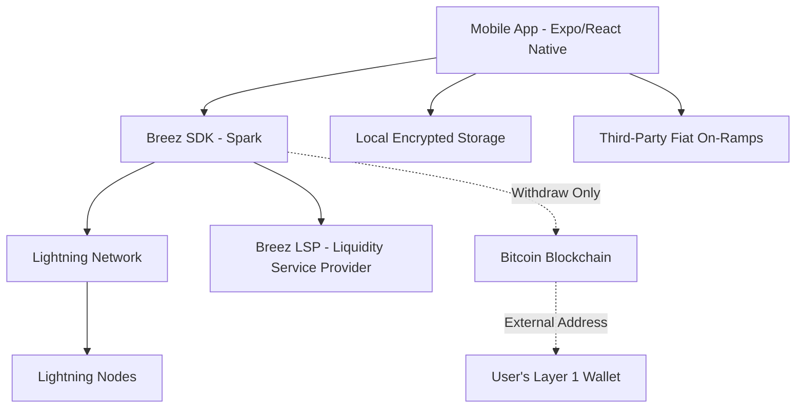
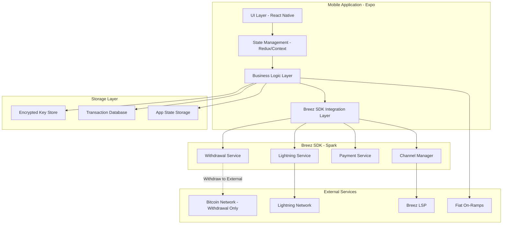
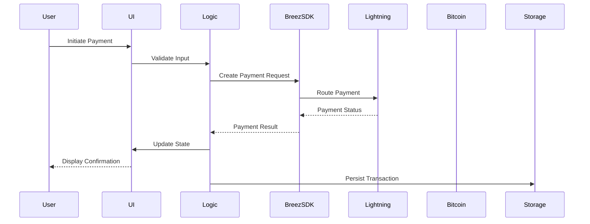
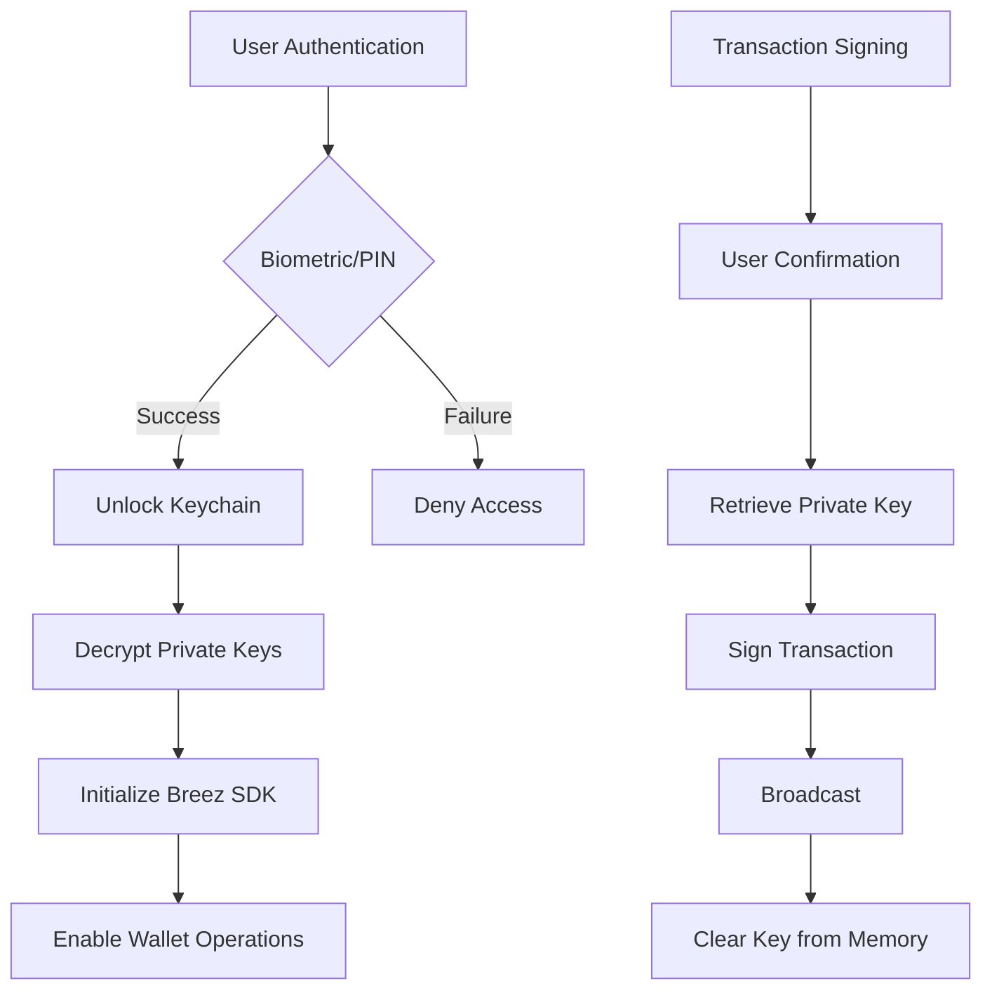
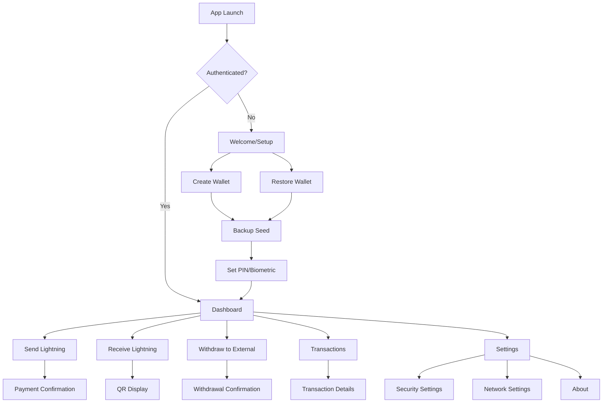
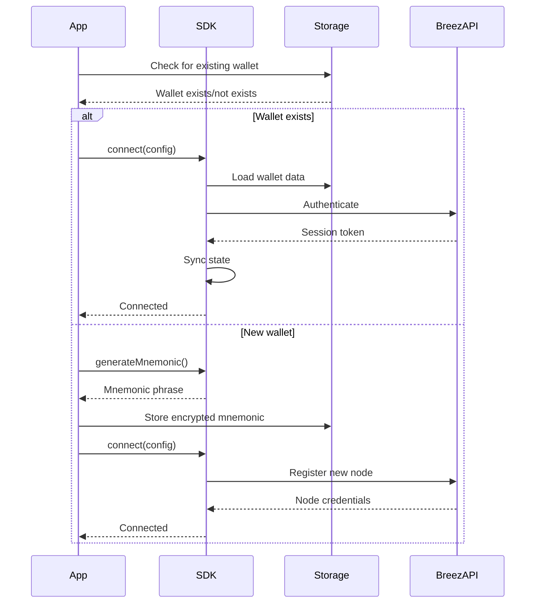
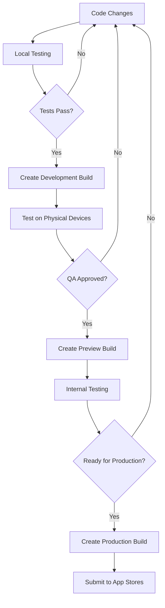
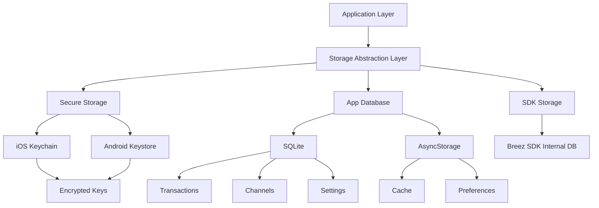
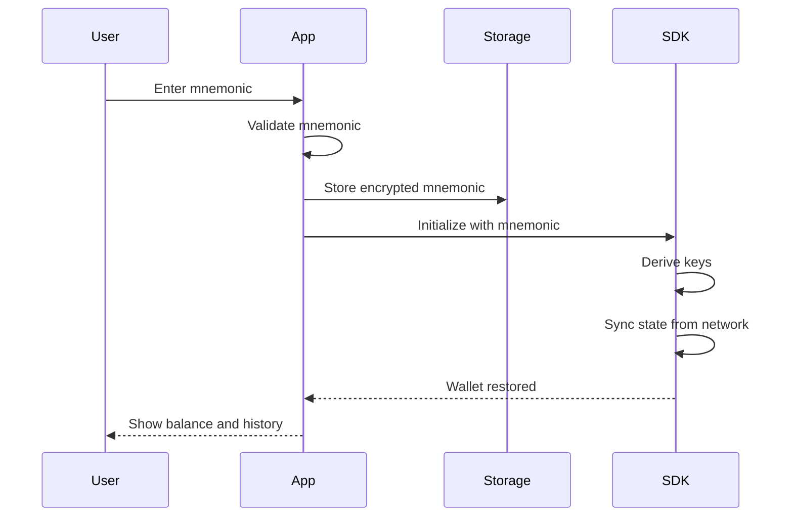
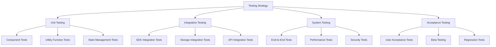

# Software Requirements Specification (SRS) - Bitcoin Lightning Wallet

# Software Requirements Specification (SRS)

## Wavespace Senior Project – Bitcoin Lightning Wallet

**Version:** 1.1  
**Prepared by:** MAB  
**Date:** 2026-02-06  
**Status:** Draft

---

## Important Architectural Note

**This wallet is Lightning-only (Layer 2).** It does NOT provide self-custodial on-chain Bitcoin management. Users can:

- ✅ Send and receive Lightning payments
- ✅ Manage Lightning channels
- ✅ Withdraw funds to external Layer 1 Bitcoin addresses
- ❌ NOT manage on-chain Bitcoin within this wallet
- ❌ NOT receive on-chain Bitcoin directly to this wallet

All Bitcoin operations are conducted through the Lightning Network. The only on-chain interaction is withdrawing Lightning funds to an external Bitcoin address that is NOT managed by this wallet.

---

## Table of Contents

1. [Introduction](#1-introduction)
2. [Overall Description](#2-overall-description)
3. [System Architecture](#3-system-architecture)
4. [Functional Requirements](#4-functional-requirements)
5. [External Interface Requirements](#5-external-interface-requirements)
6. [Non-Functional Requirements](#6-non-functional-requirements)
7. [Breez SDK Integration Requirements](#7-breez-sdk-integration-requirements)
8. [Expo Deployment Requirements](#8-expo-deployment-requirements)
9. [Data Requirements](#9-data-requirements)
10. [Testing Requirements](#10-testing-requirements)
11. [Appendices](#11-appendices)

---

## 1. Introduction

### 1.1 Purpose

This Software Requirements Specification (SRS) defines the technical requirements for developing a self-custodial Bitcoin Lightning Wallet mobile application. This document translates the business requirements outlined in file:docs/BRS.md into detailed technical specifications for the development team.

The wallet will enable users to:

- Manage Lightning Network channels and payments
- Create and pay Lightning invoices
- Send payments via LNURL and Lightning addresses
- Withdraw funds to external Layer 1 Bitcoin addresses
- View Lightning transaction history

### 1.2 Scope

**Product Name:** Wavespace Bitcoin Lightning Wallet  
**Product Features:**

- Lightning-only wallet (Layer 2)
- Breez SDK integration for Lightning Network functionality
- Cross-platform mobile application (iOS/Android) via Expo
- Local encrypted storage with no cloud dependencies
- Support for testnet and mainnet environments
- Withdrawal to external Layer 1 Bitcoin addresses

**Benefits:**

- Users maintain full control of their Lightning keys
- Simplified Lightning Network operations through Breez SDK
- No KYC/AML requirements
- Instant, low-cost Lightning payments
- Ability to withdraw to external on-chain addresses when needed

**Out of Scope:**

- Multi-device synchronization (future release)
- Cloud backup services (future release)
- Desktop/web versions
- Custom Lightning node implementation
- Self-custodial on-chain Bitcoin wallet (Layer 1)
- On-chain transaction management within the app

### 1.3 Definitions, Acronyms, and Abbreviations


| Term              | Definition                                                           |
| ----------------- | -------------------------------------------------------------------- |
| BRS               | Business Requirements Specification                                  |
| SRS               | Software Requirements Specification                                  |
| SDK               | Software Development Kit                                             |
| Lightning Network | Layer-2 payment protocol built on Bitcoin                            |
| LNURL             | Lightning Network URL scheme for simplified payments                 |
| Bolt11            | Lightning Network invoice format                                     |
| Bolt12            | Offers protocol for Lightning Network                                |
| BIP353            | Bitcoin Improvement Proposal for human-readable payment instructions |
| Expo              | Framework for building React Native applications                     |
| Breez SDK         | Self-custodial Lightning Network SDK                                 |
| Greenlight        | Breez's Lightning node infrastructure (deprecated)                   |
| Spark             | Breez's nodeless Lightning implementation                            |
| Liquid            | Bitcoin sidechain supporting multi-asset tokens                      |
| UTXO              | Unspent Transaction Output                                           |
| Satoshi (sat)     | Smallest unit of Bitcoin (0.00000001 BTC)                            |
| Mnemonic          | 12 or 24-word seed phrase for wallet recovery                        |


### 1.4 References


| Document                                 | Location                                                                           |
| ---------------------------------------- | ---------------------------------------------------------------------------------- |
| Business Requirements Specification      | file:docs/BRS.md                                                                   |
| Breez SDK Documentation                  | [https://breez.technology/sdk/](https://breez.technology/sdk/)                     |
| Breez SDK Spark Documentation            | [https://sdk-doc-spark.breez.technology/](https://sdk-doc-spark.breez.technology/) |
| Expo Documentation                       | [https://docs.expo.dev/](https://docs.expo.dev/)                                   |
| Bitcoin Lightning Network Specifications | [https://github.com/lightning/bolts](https://github.com/lightning/bolts)           |
| React Native Documentation               | [https://reactnative.dev/](https://reactnative.dev/)                               |


### 1.5 Overview

This SRS is organized into the following sections:

- **Section 2:** Overall product description and context
- **Section 3:** System architecture and design
- **Section 4:** Detailed functional requirements
- **Section 5:** External interface specifications
- **Section 6:** Non-functional requirements
- **Section 7:** Breez SDK integration requirements
- **Section 8:** Expo deployment requirements
- **Section 9:** Data models and storage requirements
- **Section 10:** Testing requirements and acceptance criteria

---

## 2. Overall Description

### 2.1 Product Perspective

The Wavespace Bitcoin Lightning Wallet is a standalone mobile application that integrates with the Bitcoin blockchain and Lightning Network. The system architecture consists of:



**System Interfaces:**

- **Breez SDK (Spark Implementation):** Provides Lightning Network functionality
- **Bitcoin Network:** Withdrawal transactions to external addresses only
- **Lightning Network:** Payment routing and channel management
- **Breez LSP:** Liquidity provisioning and channel opening services
- **Local Device Storage:** Encrypted key storage and transaction history

### 2.2 Product Functions

The wallet provides the following high-level functions:

1. **Wallet Management**
  - Create new wallet with mnemonic seed phrase
  - Restore wallet from existing mnemonic
  - Secure key storage with device encryption
  - Backup and export wallet data
2. **Withdrawal Operations**
  - Withdraw Lightning funds to external Layer 1 Bitcoin address
  - Fee estimation for withdrawal transactions
  - Confirmation of withdrawal to external wallet
3. **Lightning Network Operations**
  - Automatic channel opening via Breez LSP
  - Create Lightning invoices (Bolt11)
  - Pay Lightning invoices
  - LNURL-Pay and LNURL-Withdraw support
  - Lightning address support
  - View Lightning transaction history
  - Channel balance monitoring
4. **Payment Features**
  - QR code generation and scanning
  - BIP353 human-readable payment addresses
  - Multi-protocol payment support (Lightning, LNURL, Lightning addresses)
  - Payment request creation and sharing
5. **Security Features**
  - PIN/biometric authentication
  - Encrypted local storage (AES-256)
  - Secure key derivation (BIP39/BIP44)
  - Transaction signing with user confirmation

### 2.3 User Characteristics

Based on file:docs/BRS.md, the application serves three primary user personas:


| Persona              | Technical Expertise | Primary Use Cases                                   | UI Complexity Preference        |
| -------------------- | ------------------- | --------------------------------------------------- | ------------------------------- |
| Trader "Ted"         | High                | Rapid payments, channel analytics, fee optimization | Advanced with detailed stats    |
| Everyday User "Eve"  | Low                 | Simple payments, groceries, peer-to-peer transfers  | Simplified with minimal jargon  |
| Node Operator "Omar" | Very High           | Multi-channel management, monitoring, analytics     | Advanced with technical details |


**Design Implications:**

- Provide both simplified and advanced UI modes
- Use progressive disclosure for complex features
- Include tooltips and help documentation
- Minimize blockchain jargon in default views

### 2.4 Constraints


| Constraint Type | Description                                     | Impact                                     |
| --------------- | ----------------------------------------------- | ------------------------------------------ |
| **Technology**  | Must use Breez SDK (Spark implementation)       | Limits Lightning implementation options    |
| **Platform**    | Must deploy via Expo (custom development build) | Cannot use Expo Go; requires native builds |
| **Device**      | Mobile only (iOS/Android)                       | No desktop or web versions                 |
| **Regulatory**  | Must comply with local crypto regulations       | May require geo-restrictions               |
| **Network**     | Requires stable internet connectivity           | Offline functionality limited              |
| **Storage**     | All data stored locally on device               | No cloud sync or backup                    |
| **Development** | React Native/TypeScript stack                   | Team must have React Native expertise      |


### 2.5 Assumptions and Dependencies

**Assumptions:**

1. Users have compatible iOS (13+) or Android (8.0+) devices
2. Users have stable internet connectivity for Lightning operations
3. Breez SDK Spark implementation remains actively maintained
4. Breez LSP services remain available and reliable
5. Users understand basic cryptocurrency concepts
6. Initial deployment targets Bitcoin testnet

**Dependencies:**

1. **Breez SDK:** `@breeztech/breez-sdk-spark-react-native` npm package
2. **Expo:** Expo SDK 50+ with custom development build support
3. **React Native:** Version compatible with Expo SDK
4. **Node.js:** v22 or higher for development
5. **Breez API:** API key for Breez services
6. **Bitcoin Network:** Access to Bitcoin testnet/mainnet nodes
7. **Lightning Network:** Access to Lightning Network routing nodes

---

## 3. System Architecture

### 3.1 High-Level Architecture



### 3.2 Component Architecture

#### 3.2.1 UI Layer

- **Technology:** React Native with Expo
- **Responsibilities:**
  - Render user interface components
  - Handle user input and gestures
  - Display wallet state and transaction data
  - QR code generation and scanning
  - Biometric authentication prompts

#### 3.2.2 State Management Layer

- **Technology:** Redux Toolkit or React Context API
- **Responsibilities:**
  - Manage application state
  - Handle wallet connection status
  - Store transaction history
  - Manage user preferences
  - Synchronize UI with Breez SDK events

#### 3.2.3 Business Logic Layer

- **Responsibilities:**
  - Validate user inputs
  - Format payment amounts and addresses
  - Calculate fees and conversions
  - Handle error scenarios
  - Implement retry logic
  - Manage transaction workflows

#### 3.2.4 Breez SDK Integration Layer

- **Technology:** `@breeztech/breez-sdk-spark-react-native`
- **Responsibilities:**
  - Initialize Breez SDK
  - Connect to Lightning node
  - Create and pay invoices
  - Manage channels
  - Handle withdrawals to external addresses
  - Listen to SDK events
  - Manage SDK configuration

#### 3.2.5 Storage Layer

- **Technology:** 
  - React Native Keychain for sensitive data
  - AsyncStorage or SQLite for app data
  - Breez SDK internal storage
- **Responsibilities:**
  - Encrypt and store private keys
  - Persist transaction history
  - Store user preferences
  - Cache wallet state
  - Backup wallet data

### 3.3 Data Flow Architecture



### 3.4 Security Architecture



---

## 4. Functional Requirements

This section details the functional requirements derived from file:docs/BRS.md with technical specifications.

### 4.1 Wallet Initialization and Management

#### FR-WM-001: Wallet Creation

**Priority:** Must Have  
**Source:** New requirement (prerequisite for all operations)

**Description:**  
The system shall allow users to create a new wallet with a BIP39-compliant mnemonic seed phrase.

**Acceptance Criteria:**

- AC-WM-001-01: System generates a 12-word or 24-word mnemonic seed phrase
- AC-WM-001-02: User must confirm they have backed up the seed phrase
- AC-WM-001-03: System derives wallet keys using BIP44 derivation path
- AC-WM-001-04: Private keys are encrypted with AES-256 and stored in device keychain
- AC-WM-001-05: Wallet creation completes within 5 seconds

**Technical Specifications:**

- Use BIP39 for mnemonic generation
- Derivation path: `m/84'/0'/0'` for native SegWit
- Encryption: AES-256-GCM with device-specific key
- Storage: React Native Keychain for iOS/Android

#### FR-WM-002: Wallet Restoration

**Priority:** Must Have  
**Source:** FR-007 (Backup & Restore)

**Description:**  
The system shall allow users to restore an existing wallet using a mnemonic seed phrase.

**Acceptance Criteria:**

- AC-WM-002-01: System accepts 12-word or 24-word mnemonic input
- AC-WM-002-02: System validates mnemonic checksum
- AC-WM-002-03: System derives correct wallet keys from mnemonic
- AC-WM-002-04: System syncs transaction history from blockchain
- AC-WM-002-05: Restoration completes within 30 seconds (excluding sync)

**Technical Specifications:**

- Validate mnemonic using BIP39 checksum
- Support passphrase (BIP39 extension)
- Sync via Breez SDK's built-in sync mechanism
- Display sync progress to user

#### FR-WM-003: Wallet Security

**Priority:** Must Have  
**Source:** NFR Security requirements

**Description:**  
The system shall protect wallet access with PIN or biometric authentication.

**Acceptance Criteria:**

- AC-WM-003-01: User sets up PIN (6-digit minimum) or biometric on first launch
- AC-WM-003-02: Authentication required on app launch
- AC-WM-003-03: Authentication required before sensitive operations (send, export)
- AC-WM-003-04: Failed authentication attempts are rate-limited (3 attempts, 30-second lockout)
- AC-WM-003-05: Biometric authentication falls back to PIN if unavailable

**Technical Specifications:**

- Use React Native Biometrics library
- Store PIN hash (bcrypt) in secure storage
- Implement exponential backoff for failed attempts
- Support Face ID (iOS) and fingerprint/face unlock (Android)

### 4.2 Breez SDK Integration

#### FR-SDK-001: Breez SDK Initialization

**Priority:** Must Have  
**Source:** FR-001 (Breez SDK Implementation)

**Description:**  
The system shall initialize and configure the Breez SDK (Spark implementation) on wallet startup.

**Acceptance Criteria:**

- AC-SDK-001-01: SDK initializes with valid API key
- AC-SDK-001-02: SDK connects to appropriate network (testnet/mainnet)
- AC-SDK-001-03: SDK initialization completes within 10 seconds
- AC-SDK-001-04: System handles SDK initialization failures gracefully
- AC-SDK-001-05: SDK state is persisted across app restarts

**Technical Specifications:**

- Package: `@breeztech/breez-sdk-spark-react-native`
- Configuration: API key, network selection, working directory
- Event listeners: Payment received, payment sent, channel opened, sync complete
- Error handling: Retry logic with exponential backoff

#### FR-SDK-002: SDK Event Handling

**Priority:** Must Have  
**Source:** FR-001 (Breez SDK Implementation)

**Description:**  
The system shall listen to and handle all relevant Breez SDK events.

**Acceptance Criteria:**

- AC-SDK-002-01: System registers listeners for all SDK events
- AC-SDK-002-02: Payment events update UI within 500ms
- AC-SDK-002-03: Channel events trigger appropriate notifications
- AC-SDK-002-04: Sync events update wallet state
- AC-SDK-002-05: Error events are logged and displayed to user

**Technical Specifications:**

- Events to handle:
  - `paymentReceived`
  - `paymentSent`
  - `paymentFailed`
  - `channelOpened`
  - `channelClosed`
  - `syncComplete`
  - `nodeStateChanged`
- Use event emitter pattern for UI updates
- Persist event history for debugging

### 4.3 Payment Operations

#### FR-PAY-001: Withdraw to External Bitcoin Address

**Priority:** Must Have  
**Source:** New requirement (Lightning to Layer 1 withdrawal)

**Description:**  
The system shall allow users to withdraw Lightning funds to an external Layer 1 Bitcoin address.

**Acceptance Criteria:**

- AC-PAY-001-01: User enters external Bitcoin address and amount
- AC-PAY-001-02: System validates address format (bech32, P2SH, P2PKH)
- AC-PAY-001-03: System estimates on-chain transaction fee
- AC-PAY-001-04: System displays total cost (amount + fee) in Lightning sats
- AC-PAY-001-05: User confirms withdrawal details
- AC-PAY-001-06: Withdrawal transaction broadcasts within 30 seconds
- AC-PAY-001-07: System displays transaction ID for tracking
- AC-PAY-001-08: Withdrawal appears in transaction history

**Technical Specifications:**

- Address validation: Support bech32, P2SH, P2PKH formats
- Fee estimation: Via Breez SDK (low, medium, high priority)
- Transaction construction: Via Breez SDK withdrawal service
- Broadcast: Via Breez SDK to Bitcoin network
- Note: This address is NOT managed by the wallet - it's an external destination

#### FR-PAY-002: Receive Lightning Payments

**Priority:** Must Have  
**Source:** Core Lightning functionality

**Description:**  
The system shall allow users to receive Lightning payments via invoices.

**Acceptance Criteria:**

- AC-PAY-002-01: User creates Lightning invoice with amount and description
- AC-PAY-002-02: Invoice is displayed as text and QR code
- AC-PAY-002-03: User can copy invoice to clipboard
- AC-PAY-002-04: System monitors invoice for payment
- AC-PAY-002-05: Payment received notification appears within 1 second
- AC-PAY-002-06: Balance updates immediately upon payment

**Technical Specifications:**

- Invoice format: Bolt11
- Expiry: Configurable (default 3600 seconds)
- Amount: Required for standard invoices
- Monitoring: Via Breez SDK payment events
- Automatic channel opening: Via Breez LSP if needed

#### FR-PAY-003: Create Lightning Invoice

**Priority:** Must Have  
**Source:** FR-002 (Invoice Handling)

**Description:**  
The system shall allow users to create Lightning invoices for receiving payments.

**Acceptance Criteria:**

- AC-PAY-003-01: User specifies amount (optional) and description
- AC-PAY-003-02: System generates Bolt11 invoice
- AC-PAY-003-03: Invoice displayed as text and QR code
- AC-PAY-003-04: User can copy invoice to clipboard
- AC-PAY-003-05: Invoice includes expiry time (default 1 hour)
- AC-PAY-003-06: System monitors invoice for payment

**Technical Specifications:**

- Invoice format: Bolt11
- Expiry: Configurable (default 3600 seconds)
- Description: Max 639 bytes
- Amount: Support satoshi and BTC units
- QR code: Uppercase Bolt11 string

#### FR-PAY-004: Pay Lightning Invoice

**Priority:** Must Have  
**Source:** FR-004 (Payment Execution)

**Description:**  
The system shall allow users to pay Lightning invoices.

**Acceptance Criteria:**

- AC-PAY-004-01: User scans QR code or pastes invoice
- AC-PAY-004-02: System decodes and displays invoice details
- AC-PAY-004-03: System estimates routing fee
- AC-PAY-004-04: User confirms payment
- AC-PAY-004-05: Payment completes within 10 seconds
- AC-PAY-004-06: Payment result (success/failure) displayed to user

**Technical Specifications:**

- Invoice decoding: Via Breez SDK
- Fee estimation: Via Breez SDK routing
- Payment execution: Via Breez SDK payment service
- Retry logic: Automatic retry on temporary failures
- Error handling: Display user-friendly error messages

#### FR-PAY-005: LNURL Support

**Priority:** Must Have  
**Source:** FR-003 (Send via onchain and LNURL)

**Description:**  
The system shall support LNURL-Pay and LNURL-Withdraw protocols.

**Acceptance Criteria:**

- AC-PAY-005-01: System detects LNURL in scanned QR codes
- AC-PAY-005-02: LNURL-Pay: User specifies amount within min/max range
- AC-PAY-005-03: LNURL-Withdraw: System automatically withdraws available amount
- AC-PAY-005-04: System handles LNURL metadata (description, images)
- AC-PAY-005-05: LNURL operations complete within 15 seconds

**Technical Specifications:**

- LNURL detection: Regex pattern matching
- LNURL-Pay: Fetch callback, display metadata, send payment
- LNURL-Withdraw: Fetch callback, create invoice, receive payment
- Error handling: Handle service unavailability gracefully
- Breez SDK provides built-in LNURL support

#### FR-PAY-006: Lightning Address Support

**Priority:** Should Have  
**Source:** Breez SDK capability

**Description:**  
The system shall support sending to Lightning addresses ([user@domain.com](mailto:user@domain.com) format).

**Acceptance Criteria:**

- AC-PAY-006-01: System validates Lightning address format
- AC-PAY-006-02: System resolves address to LNURL-Pay endpoint
- AC-PAY-006-03: User specifies amount and optional message
- AC-PAY-006-04: Payment completes within 15 seconds
- AC-PAY-006-05: System caches resolved addresses for 24 hours

**Technical Specifications:**

- Format validation: `^[a-z0-9._-]+@[a-z0-9.-]+\.[a-z]{2,}$`
- Resolution: HTTPS GET to `https://domain.com/.well-known/lnurlp/user`
- Caching: Store resolved LNURL endpoints
- Breez SDK handles resolution automatically

### 4.4 Channel Management

#### FR-CH-001: Automatic Channel Opening

**Priority:** Must Have  
**Source:** FR-001 (Breez SDK Implementation)

**Description:**  
The system shall automatically open Lightning channels via Breez LSP when needed.

**Acceptance Criteria:**

- AC-CH-001-01: Channel opens automatically on first receive
- AC-CH-001-02: Channel opening completes within 30 seconds
- AC-CH-001-03: User is notified of channel opening progress
- AC-CH-001-04: Channel appears in channel list after opening
- AC-CH-001-05: System handles channel opening failures gracefully

**Technical Specifications:**

- LSP: Breez Lightning Service Provider
- Channel size: Determined by Breez LSP based on payment amount
- Fees: LSP fee displayed to user before confirmation
- Monitoring: Track channel state via SDK events
- Breez SDK handles channel opening automatically

#### FR-CH-002: Channel Balance Display

**Priority:** Must Have  
**Source:** FR-005 (Balance Overview)

**Description:**  
The system shall display Lightning channel balances and capacity.

**Acceptance Criteria:**

- AC-CH-002-01: Display total Lightning balance (local balance)
- AC-CH-002-02: Display total channel capacity
- AC-CH-002-03: Display inbound/outbound liquidity
- AC-CH-002-04: Balance updates within 500ms of state change
- AC-CH-002-05: Display balance in satoshis and BTC

**Technical Specifications:**

- Data source: Breez SDK node state
- Update frequency: Real-time via SDK events
- Display format: Satoshis (primary), BTC (secondary)
- Visual representation: Progress bar for capacity utilization

#### FR-CH-003: Channel List View

**Priority:** Should Have  
**Source:** User persona "Omar" requirements

**Description:**  
The system shall display a list of all Lightning channels with details.

**Acceptance Criteria:**

- AC-CH-003-01: List shows all active channels
- AC-CH-003-02: Each channel displays: peer, capacity, local/remote balance, state
- AC-CH-003-03: User can view channel details (channel ID, funding transaction)
- AC-CH-003-04: List updates in real-time as channel states change
- AC-CH-003-05: User can filter channels by state (active, pending, closed)

**Technical Specifications:**

- Data source: Breez SDK channel manager
- Channel states: Pending, Active, Inactive, Closed
- Details: Channel point, capacity, age, total sent/received
- Refresh: Automatic via SDK events

### 4.5 Transaction History

#### FR-HIST-001: Transaction List

**Priority:** Must Have  
**Source:** FR-006 (Transaction History)

**Description:**  
The system shall display a unified transaction history for Lightning payments and withdrawals.

**Acceptance Criteria:**

- AC-HIST-001-01: List shows all transactions (Lightning sent, Lightning received, withdrawals, pending)
- AC-HIST-001-02: Each transaction displays: type, amount, date, status
- AC-HIST-001-03: User can filter by type (Lightning, withdrawal, all)
- AC-HIST-001-04: User can search transactions by description or amount
- AC-HIST-001-05: List supports infinite scroll/pagination

**Technical Specifications:**

- Data source: Breez SDK transaction history
- Storage: Local SQLite database for caching
- Sorting: Newest first (descending timestamp)
- Pagination: Load 50 transactions per page
- Search: Full-text search on description field

#### FR-HIST-002: Transaction Details

**Priority:** Must Have  
**Source:** FR-006 (Transaction History)

**Description:**  
The system shall display detailed information for each transaction.

**Acceptance Criteria:**

- AC-HIST-002-01: Withdrawal: Show destination address, amount, fee, confirmations, txid
- AC-HIST-002-02: Lightning: Show invoice, amount, fee, preimage, description
- AC-HIST-002-03: User can copy transaction details to clipboard
- AC-HIST-002-04: User can share transaction details
- AC-HIST-002-05: User can view withdrawal transaction on block explorer

**Technical Specifications:**

- Block explorer: Configurable (default: mempool.space) for withdrawals
- Lightning: Display payment hash, preimage (if available)
- Withdrawal: Display destination address, confirmations, txid
- Share format: Plain text with all transaction details
- Copy: Individual fields or entire transaction

### 4.6 Settings and Configuration

#### FR-SET-001: Network Selection

**Priority:** Must Have  
**Source:** FR-009 (Support for Testnet)

**Description:**  
The system shall allow users to switch between testnet and mainnet.

**Acceptance Criteria:**

- AC-SET-001-01: User can select network in settings
- AC-SET-001-02: Network change requires wallet restart
- AC-SET-001-03: System displays clear warning when switching networks
- AC-SET-001-04: Testnet and mainnet data are stored separately
- AC-SET-001-05: Current network is displayed in app header

**Technical Specifications:**

- Networks: Bitcoin Testnet, Bitcoin Mainnet
- Storage: Separate directories for each network
- Warning: Modal dialog with confirmation required
- Restart: Reinitialize Breez SDK with new network
- Default: Testnet for initial releases

#### FR-SET-002: Display Units

**Priority:** Should Have  
**Source:** User experience requirement

**Description:**  
The system shall allow users to configure display units for Bitcoin amounts.

**Acceptance Criteria:**

- AC-SET-002-01: User can select unit: BTC, satoshis, or both
- AC-SET-002-02: Selected unit applies throughout the app
- AC-SET-002-03: Unit change takes effect immediately
- AC-SET-002-04: Default unit is satoshis
- AC-SET-002-05: Both units can be displayed simultaneously

**Technical Specifications:**

- Units: BTC (8 decimals), satoshis (integer)
- Conversion: 1 BTC = 100,000,000 satoshis
- Display format: Thousands separators, appropriate precision
- Storage: User preference in AsyncStorage

#### FR-SET-003: Security Settings

**Priority:** Must Have  
**Source:** FR-008 (Security Alerts)

**Description:**  
The system shall provide security configuration options.

**Acceptance Criteria:**

- AC-SET-003-01: User can change PIN
- AC-SET-003-02: User can enable/disable biometric authentication
- AC-SET-003-03: User can set auto-lock timeout (1, 5, 15 minutes, never)
- AC-SET-003-04: User can view security alerts and warnings
- AC-SET-003-05: User can export wallet backup (encrypted)

**Technical Specifications:**

- PIN change: Require current PIN, confirm new PIN
- Biometric: Check device capability before enabling
- Auto-lock: Lock app after inactivity period
- Alerts: Large balance warnings, unconfirmed transactions
- Backup: Encrypted JSON export with mnemonic

### 4.7 User Interface Requirements

#### FR-UI-001: Dashboard Screen

**Priority:** Must Have  
**Source:** Primary user interface

**Description:**  
The system shall provide a dashboard displaying wallet overview and quick actions.

**Acceptance Criteria:**

- AC-UI-001-01: Display total Lightning balance
- AC-UI-001-02: Display recent transactions (last 5)
- AC-UI-001-03: Provide quick action buttons: Send, Receive, Withdraw, Scan
- AC-UI-001-04: Display connection status
- AC-UI-001-05: Dashboard loads within 1 second

**Wireframe:**

```wireframe
<!DOCTYPE html>
<html>
<head>
<style>
* { margin: 0; padding: 0; box-sizing: border-box; }
body { font-family: -apple-system, BlinkMacSystemFont, 'Segoe UI', sans-serif; background: #f5f5f5; padding: 20px; }
.phone { max-width: 375px; margin: 0 auto; background: white; border-radius: 20px; overflow: hidden; box-shadow: 0 4px 20px rgba(0,0,0,0.1); }
.header { background: linear-gradient(135deg, #667eea 0%, #764ba2 100%); color: white; padding: 40px 20px 30px; }
.network-badge { display: inline-block; background: rgba(255,255,255,0.2); padding: 4px 12px; border-radius: 12px; font-size: 12px; margin-bottom: 10px; }
.balance-label { font-size: 14px; opacity: 0.9; margin-bottom: 5px; }
.balance-amount { font-size: 36px; font-weight: bold; margin-bottom: 5px; }
.balance-fiat { font-size: 16px; opacity: 0.8; }
.quick-actions { display: flex; gap: 15px; padding: 20px; background: white; }
.action-btn { flex: 1; background: #f8f9fa; border: none; border-radius: 12px; padding: 20px 10px; text-align: center; cursor: pointer; }
.action-btn:active { background: #e9ecef; }
.action-icon { font-size: 24px; margin-bottom: 8px; }
.action-label { font-size: 13px; color: #495057; }
.section { padding: 20px; }
.section-header { display: flex; justify-content: space-between; align-items: center; margin-bottom: 15px; }
.section-title { font-size: 18px; font-weight: 600; color: #212529; }
.see-all { font-size: 14px; color: #667eea; text-decoration: none; }
.transaction-item { display: flex; align-items: center; padding: 12px 0; border-bottom: 1px solid #f0f0f0; }
.tx-icon { width: 40px; height: 40px; border-radius: 20px; background: #f8f9fa; display: flex; align-items: center; justify-content: center; margin-right: 12px; font-size: 18px; }
.tx-details { flex: 1; }
.tx-description { font-size: 14px; color: #212529; margin-bottom: 3px; }
.tx-date { font-size: 12px; color: #6c757d; }
.tx-amount { font-size: 15px; font-weight: 600; }
.tx-amount.positive { color: #28a745; }
.tx-amount.negative { color: #dc3545; }
.status-bar { display: flex; justify-content: space-around; padding: 15px 20px; background: #f8f9fa; border-top: 1px solid #e9ecef; }
.status-item { text-align: center; }
.status-label { font-size: 11px; color: #6c757d; margin-bottom: 3px; }
.status-value { font-size: 13px; font-weight: 600; color: #212529; }
</style>
</head>
<body>
<div class="phone">
  <div class="header">
    <div class="network-badge">⚡ Testnet</div>
    <div class="balance-label">Lightning Balance</div>
    <div class="balance-amount">1,234,567 sats</div>
    <div class="balance-fiat">≈ $456.78 USD</div>
  </div>
  
  <div class="quick-actions">
    <button class="action-btn" data-element-id="send-btn">
      <div class="action-icon">⚡</div>
      <div class="action-label">Send</div>
    </button>
    <button class="action-btn" data-element-id="receive-btn">
      <div class="action-icon">↓</div>
      <div class="action-label">Receive</div>
    </button>
    <button class="action-btn" data-element-id="withdraw-btn">
      <div class="action-icon">🔗</div>
      <div class="action-label">Withdraw</div>
    </button>
    <button class="action-btn" data-element-id="scan-btn">
      <div class="action-icon">⊡</div>
      <div class="action-label">Scan</div>
    </button>
  </div>
  
  <div class="section">
    <div class="section-header">
      <div class="section-title">Recent Activity</div>
      <a href="#" class="see-all" data-element-id="see-all-link">See All</a>
    </div>
    
    <div class="transaction-item">
      <div class="tx-icon">⚡</div>
      <div class="tx-details">
        <div class="tx-description">Coffee payment</div>
        <div class="tx-date">2 hours ago</div>
      </div>
      <div class="tx-amount negative">-5,000</div>
    </div>
    
    <div class="transaction-item">
      <div class="tx-icon">↓</div>
      <div class="tx-details">
        <div class="tx-description">Received payment</div>
        <div class="tx-date">Yesterday</div>
      </div>
      <div class="tx-amount positive">+50,000</div>
    </div>
    
    <div class="transaction-item">
      <div class="tx-icon">⚡</div>
      <div class="tx-details">
        <div class="tx-description">Lightning invoice</div>
        <div class="tx-date">2 days ago</div>
      </div>
      <div class="tx-amount negative">-12,500</div>
    </div>
  </div>
  
  <div class="status-bar">
    <div class="status-item">
      <div class="status-label">Inbound</div>
      <div class="status-value">500,000 sats</div>
    </div>
    <div class="status-item">
      <div class="status-label">Outbound</div>
      <div class="status-value">734,567 sats</div>
    </div>
    <div class="status-item">
      <div class="status-label">Channels</div>
      <div class="status-value">2 active</div>
    </div>
  </div>
</div>
</body>
</html>
```

#### FR-UI-002: Send Payment Screen

**Priority:** Must Have  
**Source:** Payment functionality

**Description:**  
The system shall provide a unified interface for sending all payment types.

**Acceptance Criteria:**

- AC-UI-002-01: Support input methods: paste, scan QR, manual entry
- AC-UI-002-02: Auto-detect payment type (Lightning invoice, LNURL, Lightning address)
- AC-UI-002-03: Display decoded payment details before confirmation
- AC-UI-002-04: Show estimated routing fees
- AC-UI-002-05: Provide amount input with unit conversion

**Wireframe:**

```wireframe
<!DOCTYPE html>
<html>
<head>
<style>
* { margin: 0; padding: 0; box-sizing: border-box; }
body { font-family: -apple-system, BlinkMacSystemFont, 'Segoe UI', sans-serif; background: #f5f5f5; padding: 20px; }
.phone { max-width: 375px; margin: 0 auto; background: white; border-radius: 20px; overflow: hidden; box-shadow: 0 4px 20px rgba(0,0,0,0.1); }
.header { background: #667eea; color: white; padding: 20px; display: flex; align-items: center; }
.back-btn { background: none; border: none; color: white; font-size: 24px; margin-right: 15px; cursor: pointer; }
.header-title { font-size: 20px; font-weight: 600; }
.content { padding: 20px; }
.input-section { margin-bottom: 25px; }
.label { font-size: 13px; color: #6c757d; margin-bottom: 8px; font-weight: 500; }
.input-group { position: relative; }
.input-field { width: 100%; padding: 15px; border: 2px solid #e9ecef; border-radius: 12px; font-size: 15px; }
.input-field:focus { outline: none; border-color: #667eea; }
.input-actions { display: flex; gap: 10px; margin-top: 10px; }
.input-action-btn { flex: 1; padding: 10px; background: #f8f9fa; border: none; border-radius: 8px; font-size: 13px; cursor: pointer; }
.input-action-btn:active { background: #e9ecef; }
.amount-input { font-size: 32px; text-align: center; padding: 20px; border: none; font-weight: 600; }
.amount-input:focus { outline: none; }
.unit-toggle { display: flex; justify-content: center; gap: 10px; margin-top: 10px; }
.unit-btn { padding: 6px 16px; background: #f8f9fa; border: none; border-radius: 16px; font-size: 13px; cursor: pointer; }
.unit-btn.active { background: #667eea; color: white; }
.conversion { text-align: center; color: #6c757d; font-size: 14px; margin-top: 8px; }
.payment-details { background: #f8f9fa; border-radius: 12px; padding: 15px; margin-bottom: 20px; }
.detail-row { display: flex; justify-content: space-between; padding: 8px 0; }
.detail-label { font-size: 14px; color: #6c757d; }
.detail-value { font-size: 14px; color: #212529; font-weight: 500; }
.warning-box { background: #fff3cd; border-left: 4px solid #ffc107; padding: 12px; border-radius: 8px; margin-bottom: 20px; }
.warning-text { font-size: 13px; color: #856404; }
.send-btn { width: 100%; padding: 16px; background: #667eea; color: white; border: none; border-radius: 12px; font-size: 16px; font-weight: 600; cursor: pointer; }
.send-btn:active { background: #5568d3; }
.send-btn:disabled { background: #adb5bd; cursor: not-allowed; }
</style>
</head>
<body>
<div class="phone">
  <div class="header">
    <button class="back-btn" data-element-id="back-btn">←</button>
    <div class="header-title">Send Payment</div>
  </div>
  
  <div class="content">
    <div class="input-section">
      <div class="label">RECIPIENT</div>
      <div class="input-group">
        <input type="text" class="input-field" placeholder="Address, invoice, or Lightning address" data-element-id="recipient-input">
      </div>
      <div class="input-actions">
        <button class="input-action-btn" data-element-id="paste-btn">📋 Paste</button>
        <button class="input-action-btn" data-element-id="scan-btn">📷 Scan QR</button>
      </div>
    </div>
    
    <div class="input-section">
      <div class="label">AMOUNT</div>
      <input type="text" class="amount-input" placeholder="0" data-element-id="amount-input">
      <div class="unit-toggle">
        <button class="unit-btn active" data-element-id="sats-btn">sats</button>
        <button class="unit-btn" data-element-id="btc-btn">BTC</button>
      </div>
      <div class="conversion">≈ $0.00 USD</div>
    </div>
    
    <div class="payment-details">
      <div class="detail-row">
        <div class="detail-label">Payment Type</div>
        <div class="detail-value">Lightning ⚡</div>
      </div>
      <div class="detail-row">
        <div class="detail-label">Network Fee</div>
        <div class="detail-value">~50 sats</div>
      </div>
      <div class="detail-row">
        <div class="detail-label">Total</div>
        <div class="detail-value" style="font-weight: 600;">0 sats</div>
      </div>
    </div>
    
    <div class="warning-box">
      <div class="warning-text">⚠️ Lightning payments are instant and irreversible. Please verify the recipient before sending.</div>
    </div>
    
    <button class="send-btn" disabled data-element-id="send-btn">Send Payment</button>
  </div>
</div>
</body>
</html>
```

#### FR-UI-003: Receive Payment Screen

**Priority:** Must Have  
**Source:** Payment functionality

**Description:**  
The system shall provide an interface for receiving payments with QR code display.

**Acceptance Criteria:**

- AC-UI-003-01: User creates Lightning invoice only (no on-chain option)
- AC-UI-003-02: User can specify amount (optional for Lightning)
- AC-UI-003-03: Display QR code for Lightning invoice
- AC-UI-003-04: Provide copy and share buttons
- AC-UI-003-05: Show payment status when received

**Wireframe:**

```wireframe
<!DOCTYPE html>
<html>
<head>
<style>
* { margin: 0; padding: 0; box-sizing: border-box; }
body { font-family: -apple-system, BlinkMacSystemFont, 'Segoe UI', sans-serif; background: #f5f5f5; padding: 20px; }
.phone { max-width: 375px; margin: 0 auto; background: white; border-radius: 20px; overflow: hidden; box-shadow: 0 4px 20px rgba(0,0,0,0.1); }
.header { background: #667eea; color: white; padding: 20px; display: flex; align-items: center; }
.back-btn { background: none; border: none; color: white; font-size: 24px; margin-right: 15px; cursor: pointer; }
.header-title { font-size: 20px; font-weight: 600; }
.content { padding: 20px; }
.payment-type-toggle { display: flex; gap: 10px; margin-bottom: 25px; }
.type-btn { flex: 1; padding: 12px; background: #f8f9fa; border: none; border-radius: 12px; font-size: 14px; cursor: pointer; font-weight: 500; }
.type-btn.active { background: #667eea; color: white; }
.amount-section { margin-bottom: 25px; }
.label { font-size: 13px; color: #6c757d; margin-bottom: 8px; font-weight: 500; }
.amount-input { width: 100%; font-size: 32px; text-align: center; padding: 20px; border: 2px solid #e9ecef; border-radius: 12px; font-weight: 600; }
.amount-input:focus { outline: none; border-color: #667eea; }
.conversion { text-align: center; color: #6c757d; font-size: 14px; margin-top: 8px; }
.qr-section { background: #f8f9fa; border-radius: 12px; padding: 20px; margin-bottom: 20px; text-align: center; }
.qr-code { width: 200px; height: 200px; background: white; margin: 0 auto 15px; border-radius: 8px; display: flex; align-items: center; justify-content: center; font-size: 80px; }
.qr-label { font-size: 13px; color: #6c757d; margin-bottom: 10px; }
.address-text { font-size: 11px; color: #495057; word-break: break-all; padding: 10px; background: white; border-radius: 8px; font-family: monospace; }
.action-buttons { display: flex; gap: 10px; margin-bottom: 20px; }
.action-btn { flex: 1; padding: 14px; background: #f8f9fa; border: none; border-radius: 12px; font-size: 14px; cursor: pointer; font-weight: 500; }
.action-btn:active { background: #e9ecef; }
.info-box { background: #e7f3ff; border-left: 4px solid #0066cc; padding: 12px; border-radius: 8px; }
.info-text { font-size: 13px; color: #004085; }
.expiry-timer { text-align: center; color: #6c757d; font-size: 13px; margin-top: 15px; }
</style>
</head>
<body>
<div class="phone">
  <div class="header">
    <button class="back-btn" data-element-id="back-btn">←</button>
    <div class="header-title">Receive Payment</div>
  </div>
  
  <div class="content">
    
    <div class="amount-section">
      <div class="label">AMOUNT (OPTIONAL)</div>
      <input type="text" class="amount-input" placeholder="0" data-element-id="amount-input">
      <div class="conversion">≈ $0.00 USD</div>
    </div>
    
    <div class="qr-section">
      <div class="qr-label">Scan QR Code</div>
      <div class="qr-code">⊡</div>
      <div class="address-text" data-element-id="address-text">lnbc1500n1pn2s38pp5q9v9k...</div>
    </div>
    
    <div class="action-buttons">
      <button class="action-btn" data-element-id="copy-btn">📋 Copy</button>
      <button class="action-btn" data-element-id="share-btn">↗️ Share</button>
    </div>
    
    <div class="info-box">
      <div class="info-text">💡 Lightning invoices expire in 1 hour. The payment will be received instantly.</div>
    </div>
    
    <div class="expiry-timer">Expires in 59:45</div>
  </div>
</div>
</body>
</html>
```

#### FR-UI-004: Withdraw to External Address Screen

**Priority:** Must Have  
**Source:** Withdrawal functionality

**Description:**  
The system shall provide an interface for withdrawing Lightning funds to an external Layer 1 Bitcoin address.

**Acceptance Criteria:**

- AC-UI-004-01: User enters external Bitcoin address
- AC-UI-004-02: User specifies withdrawal amount
- AC-UI-004-03: System displays on-chain fee estimate
- AC-UI-004-04: System shows total cost (amount + fee) deducted from Lightning balance
- AC-UI-004-05: User confirms withdrawal details
- AC-UI-004-06: System displays transaction ID after broadcast

**Wireframe:**

```wireframe
<!DOCTYPE html>
<html>
<head>
<style>
* { margin: 0; padding: 0; box-sizing: border-box; }
body { font-family: -apple-system, BlinkMacSystemFont, 'Segoe UI', sans-serif; background: #f5f5f5; padding: 20px; }
.phone { max-width: 375px; margin: 0 auto; background: white; border-radius: 20px; overflow: hidden; box-shadow: 0 4px 20px rgba(0,0,0,0.1); }
.header { background: #667eea; color: white; padding: 20px; display: flex; align-items: center; }
.back-btn { background: none; border: none; color: white; font-size: 24px; margin-right: 15px; cursor: pointer; }
.header-title { font-size: 20px; font-weight: 600; }
.content { padding: 20px; }
.input-section { margin-bottom: 25px; }
.label { font-size: 13px; color: #6c757d; margin-bottom: 8px; font-weight: 500; }
.input-field { width: 100%; padding: 15px; border: 2px solid #e9ecef; border-radius: 12px; font-size: 15px; }
.input-field:focus { outline: none; border-color: #667eea; }
.input-actions { display: flex; gap: 10px; margin-top: 10px; }
.input-action-btn { flex: 1; padding: 10px; background: #f8f9fa; border: none; border-radius: 8px; font-size: 13px; cursor: pointer; }
.input-action-btn:active { background: #e9ecef; }
.amount-input { font-size: 32px; text-align: center; padding: 20px; border: 2px solid #e9ecef; border-radius: 12px; font-weight: 600; }
.amount-input:focus { outline: none; border-color: #667eea; }
.unit-toggle { display: flex; justify-content: center; gap: 10px; margin-top: 10px; }
.unit-btn { padding: 6px 16px; background: #f8f9fa; border: none; border-radius: 16px; font-size: 13px; cursor: pointer; }
.unit-btn.active { background: #667eea; color: white; }
.conversion { text-align: center; color: #6c757d; font-size: 14px; margin-top: 8px; }
.fee-section { background: #f8f9fa; border-radius: 12px; padding: 15px; margin-bottom: 20px; }
.fee-row { display: flex; justify-content: space-between; padding: 8px 0; }
.fee-label { font-size: 14px; color: #6c757d; }
.fee-value { font-size: 14px; color: #212529; font-weight: 500; }
.fee-selector { display: flex; gap: 8px; margin-top: 10px; }
.fee-option { flex: 1; padding: 10px; background: white; border: 2px solid #e9ecef; border-radius: 8px; text-align: center; cursor: pointer; }
.fee-option.active { border-color: #667eea; background: #f0f4ff; }
.fee-option-label { font-size: 12px; color: #6c757d; margin-bottom: 4px; }
.fee-option-value { font-size: 14px; font-weight: 600; color: #212529; }
.warning-box { background: #fff3cd; border-left: 4px solid #ffc107; padding: 12px; border-radius: 8px; margin-bottom: 20px; }
.warning-text { font-size: 13px; color: #856404; }
.info-box { background: #e7f3ff; border-left: 4px solid #0066cc; padding: 12px; border-radius: 8px; margin-bottom: 20px; }
.info-text { font-size: 13px; color: #004085; }
.withdraw-btn { width: 100%; padding: 16px; background: #667eea; color: white; border: none; border-radius: 12px; font-size: 16px; font-weight: 600; cursor: pointer; }
.withdraw-btn:active { background: #5568d3; }
.withdraw-btn:disabled { background: #adb5bd; cursor: not-allowed; }
</style>
</head>
<body>
<div class="phone">
  <div class="header">
    <button class="back-btn" data-element-id="back-btn">←</button>
    <div class="header-title">Withdraw to External Wallet</div>
  </div>
  
  <div class="content">
    <div class="input-section">
      <div class="label">DESTINATION BITCOIN ADDRESS</div>
      <input type="text" class="input-field" placeholder="bc1q..." data-element-id="address-input">
      <div class="input-actions">
        <button class="input-action-btn" data-element-id="paste-btn">📋 Paste</button>
        <button class="input-action-btn" data-element-id="scan-btn">📷 Scan QR</button>
      </div>
    </div>
    
    <div class="input-section">
      <div class="label">AMOUNT</div>
      <input type="text" class="amount-input" placeholder="0" data-element-id="amount-input">
      <div class="unit-toggle">
        <button class="unit-btn active" data-element-id="sats-btn">sats</button>
        <button class="unit-btn" data-element-id="btc-btn">BTC</button>
      </div>
      <div class="conversion">≈ $0.00 USD</div>
    </div>
    
    <div class="fee-section">
      <div class="fee-row">
        <div class="fee-label">On-chain Fee Priority</div>
      </div>
      <div class="fee-selector">
        <div class="fee-option" data-element-id="low-fee">
          <div class="fee-option-label">Low</div>
          <div class="fee-option-value">~500 sats</div>
        </div>
        <div class="fee-option active" data-element-id="medium-fee">
          <div class="fee-option-label">Medium</div>
          <div class="fee-option-value">~1,000 sats</div>
        </div>
        <div class="fee-option" data-element-id="high-fee">
          <div class="fee-option-label">High</div>
          <div class="fee-option-value">~2,000 sats</div>
        </div>
      </div>
      <div class="fee-row" style="margin-top: 15px; padding-top: 15px; border-top: 1px solid #e9ecef;">
        <div class="fee-label">Total Deducted from Lightning</div>
        <div class="fee-value" style="font-weight: 600; font-size: 16px;">0 sats</div>
      </div>
    </div>
    
    <div class="info-box">
      <div class="info-text">ℹ️ This address is NOT managed by this wallet. Funds will be sent to your external Layer 1 Bitcoin wallet.</div>
    </div>
    
    <div class="warning-box">
      <div class="warning-text">⚠️ Withdrawals are irreversible. Please verify the destination address carefully.</div>
    </div>
    
    <button class="withdraw-btn" disabled data-element-id="withdraw-btn">Withdraw to External Wallet</button>
  </div>
</div>
</body>
</html>
```

#### FR-UI-005: Transaction History Screen

**Priority:** Must Have  
**Source:** FR-006 (Transaction History)

**Description:**  
The system shall provide a comprehensive transaction history view.

**Acceptance Criteria:**

- AC-UI-004-01: Display all transactions in chronological order
- AC-UI-004-02: Support filtering by type and status
- AC-UI-004-03: Support search functionality
- AC-UI-004-04: Tap transaction to view details
- AC-UI-004-05: Pull to refresh

**Wireframe:**

```wireframe
<!DOCTYPE html>
<html>
<head>
<style>
* { margin: 0; padding: 0; box-sizing: border-box; }
body { font-family: -apple-system, BlinkMacSystemFont, 'Segoe UI', sans-serif; background: #f5f5f5; padding: 20px; }
.phone { max-width: 375px; margin: 0 auto; background: white; border-radius: 20px; overflow: hidden; box-shadow: 0 4px 20px rgba(0,0,0,0.1); }
.header { background: #667eea; color: white; padding: 20px; }
.header-title { font-size: 24px; font-weight: 600; margin-bottom: 15px; }
.search-bar { background: rgba(255,255,255,0.2); border-radius: 12px; padding: 10px 15px; display: flex; align-items: center; }
.search-input { background: none; border: none; color: white; flex: 1; font-size: 15px; }
.search-input::placeholder { color: rgba(255,255,255,0.7); }
.search-input:focus { outline: none; }
.filter-tabs { display: flex; gap: 10px; padding: 15px 20px; background: white; border-bottom: 1px solid #e9ecef; overflow-x: auto; }
.filter-tab { padding: 8px 16px; background: #f8f9fa; border: none; border-radius: 20px; font-size: 13px; white-space: nowrap; cursor: pointer; }
.filter-tab.active { background: #667eea; color: white; }
.transaction-list { padding: 0 20px; }
.date-group { margin-top: 20px; }
.date-header { font-size: 13px; color: #6c757d; font-weight: 600; margin-bottom: 10px; }
.transaction-item { display: flex; align-items: center; padding: 15px 0; border-bottom: 1px solid #f0f0f0; cursor: pointer; }
.transaction-item:active { background: #f8f9fa; }
.tx-icon { width: 44px; height: 44px; border-radius: 22px; background: #f8f9fa; display: flex; align-items: center; justify-content: center; margin-right: 12px; font-size: 20px; }
.tx-icon.lightning { background: #fff3cd; }
.tx-icon.onchain { background: #d1ecf1; }
.tx-icon.pending { background: #f8d7da; }
.tx-details { flex: 1; }
.tx-description { font-size: 15px; color: #212529; margin-bottom: 4px; font-weight: 500; }
.tx-meta { font-size: 12px; color: #6c757d; }
.tx-amount { text-align: right; }
.tx-amount-value { font-size: 16px; font-weight: 600; margin-bottom: 4px; }
.tx-amount-value.positive { color: #28a745; }
.tx-amount-value.negative { color: #212529; }
.tx-status { font-size: 11px; padding: 3px 8px; border-radius: 10px; display: inline-block; }
.tx-status.confirmed { background: #d4edda; color: #155724; }
.tx-status.pending { background: #fff3cd; color: #856404; }
.empty-state { text-align: center; padding: 60px 20px; color: #6c757d; }
</style>
</head>
<body>
<div class="phone">
  <div class="header">
    <div class="header-title">Transactions</div>
    <div class="search-bar">
      <span style="margin-right: 10px;">🔍</span>
      <input type="text" class="search-input" placeholder="Search transactions..." data-element-id="search-input">
    </div>
  </div>
  
  <div class="filter-tabs">
    <button class="filter-tab active" data-element-id="all-tab">All</button>
    <button class="filter-tab" data-element-id="lightning-tab">⚡ Lightning</button>
    <button class="filter-tab" data-element-id="withdrawal-tab">🔗 Withdrawals</button>
    <button class="filter-tab" data-element-id="pending-tab">⏳ Pending</button>
  </div>
  
  <div class="transaction-list">
    <div class="date-group">
      <div class="date-header">TODAY</div>
      
      <div class="transaction-item" data-element-id="tx-1">
        <div class="tx-icon lightning">⚡</div>
        <div class="tx-details">
          <div class="tx-description">Coffee payment</div>
          <div class="tx-meta">2:34 PM • Lightning</div>
        </div>
        <div class="tx-amount">
          <div class="tx-amount-value negative">-5,000 sats</div>
          <div class="tx-status confirmed">Confirmed</div>
        </div>
      </div>
      
      <div class="transaction-item" data-element-id="tx-2">
        <div class="tx-icon lightning">⚡</div>
        <div class="tx-details">
          <div class="tx-description">Received payment</div>
          <div class="tx-meta">11:20 AM • Lightning</div>
        </div>
        <div class="tx-amount">
          <div class="tx-amount-value positive">+25,000 sats</div>
          <div class="tx-status confirmed">Confirmed</div>
        </div>
      </div>
    </div>
    
    <div class="date-group">
      <div class="date-header">YESTERDAY</div>
      
      <div class="transaction-item" data-element-id="tx-3">
        <div class="tx-icon onchain">🔗</div>
        <div class="tx-details">
          <div class="tx-description">Withdrawal to external wallet</div>
          <div class="tx-meta">6:15 PM • 6 confirmations</div>
        </div>
        <div class="tx-amount">
          <div class="tx-amount-value negative">-100,000 sats</div>
          <div class="tx-status confirmed">Confirmed</div>
        </div>
      </div>
      
      <div class="transaction-item" data-element-id="tx-4">
        <div class="tx-icon lightning">⚡</div>
        <div class="tx-details">
          <div class="tx-description">LNURL withdrawal</div>
          <div class="tx-meta">3:45 PM • Lightning</div>
        </div>
        <div class="tx-amount">
          <div class="tx-amount-value positive">+50,000 sats</div>
          <div class="tx-status confirmed">Confirmed</div>
        </div>
      </div>
    </div>
    
    <div class="date-group">
      <div class="date-header">FEB 4, 2026</div>
      
      <div class="transaction-item" data-element-id="tx-5">
        <div class="tx-icon pending">⏳</div>
        <div class="tx-details">
          <div class="tx-description">Channel opening</div>
          <div class="tx-meta">9:30 AM • 1 confirmation</div>
        </div>
        <div class="tx-amount">
          <div class="tx-amount-value negative">-200,000 sats</div>
          <div class="tx-status pending">Pending</div>
        </div>
      </div>
    </div>
  </div>
</div>
</body>
</html>
```

---

## 5. External Interface Requirements

### 5.1 User Interfaces

#### 5.1.1 General UI Requirements


| Requirement        | Specification                                               |
| ------------------ | ----------------------------------------------------------- |
| **Platform**       | iOS 13+ and Android 8.0+                                    |
| **Framework**      | React Native via Expo                                       |
| **Design System**  | Material Design (Android), Human Interface Guidelines (iOS) |
| **Responsiveness** | Support screen sizes from 4.7" to 6.7"                      |
| **Orientation**    | Portrait only (landscape optional)                          |
| **Accessibility**  | WCAG 2.1 Level AA compliance                                |
| **Localization**   | English (initial), support for i18n framework               |
| **Theme**          | Light mode (initial), dark mode (future)                    |


#### 5.1.2 Navigation Structure



#### 5.1.3 Screen Requirements


| Screen              | Purpose                              | Key Elements                                             |
| ------------------- | ------------------------------------ | -------------------------------------------------------- |
| **Welcome**         | First-time user onboarding           | Create/Restore options, app intro                        |
| **Wallet Setup**    | Wallet creation flow                 | Mnemonic display, backup confirmation                    |
| **Dashboard**       | Main wallet overview                 | Lightning balance, quick actions, recent transactions    |
| **Send**            | Initiate Lightning payments          | Recipient input, amount, routing fee                     |
| **Receive**         | Generate Lightning invoices          | QR code, invoice display                                 |
| **Withdraw**        | Withdraw to external Layer 1 address | Destination address, amount, on-chain fee                |
| **Transactions**    | Transaction history                  | Filterable list (Lightning/withdrawals), search, details |
| **Settings**        | App configuration                    | Network, security, display preferences                   |
| **Channel Manager** | Lightning channel overview           | Channel list, capacity, liquidity                        |


### 5.2 Hardware Interfaces

#### 5.2.1 Camera

- **Purpose:** QR code scanning for addresses and invoices
- **Requirements:**
  - Access device rear camera
  - Real-time QR code detection
  - Support for low-light conditions
  - Fallback to manual input if camera unavailable

#### 5.2.2 Biometric Sensors

- **Purpose:** User authentication
- **Requirements:**
  - Face ID (iOS)
  - Touch ID (iOS)
  - Fingerprint sensor (Android)
  - Face unlock (Android)
  - Graceful degradation to PIN if unavailable

#### 5.2.3 Secure Storage

- **Purpose:** Private key storage
- **Requirements:**
  - iOS Keychain Services
  - Android Keystore System
  - Hardware-backed encryption when available
  - Secure Enclave (iOS) / StrongBox (Android) support

#### 5.2.4 Network Interfaces

- **Purpose:** Bitcoin and Lightning network communication
- **Requirements:**
  - WiFi and cellular data support
  - Handle network transitions gracefully
  - Offline mode for viewing balances/history
  - Background sync when app is inactive

### 5.3 Software Interfaces

#### 5.3.1 Breez SDK Interface


| Interface         | Specification                             |
| ----------------- | ----------------------------------------- |
| **Package**       | `@breeztech/breez-sdk-spark-react-native` |
| **Version**       | Latest stable (1.x)                       |
| **API Type**      | Asynchronous JavaScript API               |
| **Communication** | Native module bridge                      |
| **Data Format**   | JSON                                      |


**Key SDK Methods:**

- `connect()`: Initialize SDK connection
- `disconnect()`: Cleanup SDK resources
- `nodeInfo()`: Get node state and balances
- `receivePayment()`: Create Lightning invoice
- `sendPayment()`: Pay Lightning invoice
- `withdrawOnchain()`: Withdraw to external Bitcoin address
- `listPayments()`: Retrieve transaction history
- `addEventListener()`: Register event listeners

#### 5.3.2 Bitcoin Network Interface


| Interface              | Specification                                                             |
| ---------------------- | ------------------------------------------------------------------------- |
| **Protocol**           | Bitcoin P2P protocol                                                      |
| **Network**            | Testnet (initial), Mainnet (production)                                   |
| **Node Access**        | Via Breez SDK (abstracted)                                                |
| **Transaction Format** | SegWit (bech32) for withdrawals only                                      |
| **Fee Estimation**     | Via Breez SDK fee service                                                 |
| **Usage**              | Withdrawal to external addresses only (no self-custodial on-chain wallet) |


#### 5.3.3 Lightning Network Interface


| Interface           | Specification                         |
| ------------------- | ------------------------------------- |
| **Protocol**        | Lightning Network BOLT specifications |
| **Node Type**       | Breez Spark (nodeless)                |
| **LSP**             | Breez Lightning Service Provider      |
| **Invoice Format**  | Bolt11, Bolt12 (future)               |
| **Payment Routing** | Automatic via Breez SDK               |


#### 5.3.4 Storage Interface


| Interface          | Specification               |
| ------------------ | --------------------------- |
| **Secure Storage** | React Native Keychain       |
| **App Storage**    | AsyncStorage or SQLite      |
| **SDK Storage**    | Breez SDK internal database |
| **Backup Format**  | Encrypted JSON              |


### 5.4 Communications Interfaces

#### 5.4.1 Network Protocols


| Protocol          | Purpose           | Specification                |
| ----------------- | ----------------- | ---------------------------- |
| **HTTPS**         | API communication | TLS 1.3, certificate pinning |
| **WebSocket**     | Real-time updates | WSS (secure WebSocket)       |
| **Bitcoin P2P**   | Blockchain sync   | Via Breez SDK                |
| **Lightning P2P** | Payment routing   | Via Breez SDK                |


#### 5.4.2 Data Exchange Formats


| Format       | Usage                                 |
| ------------ | ------------------------------------- |
| **JSON**     | API requests/responses, app state     |
| **Protobuf** | Lightning Network messages (internal) |
| **BIP21**    | Bitcoin payment URIs                  |
| **Bolt11**   | Lightning invoices                    |
| **LNURL**    | Lightning URL scheme                  |


#### 5.4.3 External Services


| Service               | Purpose            | Interface             |
| --------------------- | ------------------ | --------------------- |
| **Breez API**         | SDK services, LSP  | HTTPS REST API        |
| **Block Explorers**   | Transaction lookup | HTTPS (optional)      |
| **Fiat On-Ramps**     | Buy Bitcoin        | HTTPS, OAuth (future) |
| **Exchange Rate API** | BTC/USD conversion | HTTPS REST API        |


---

## 6. Non-Functional Requirements

### 6.1 Performance Requirements


| Requirement ID   | Category               | Specification             | Measurement     |
| ---------------- | ---------------------- | ------------------------- | --------------- |
| **NFR-PERF-001** | Response Time          | UI updates < 500ms        | 95th percentile |
| **NFR-PERF-002** | Channel Opening        | < 30 seconds              | Average         |
| **NFR-PERF-003** | Lightning Payment      | < 10 seconds              | 95th percentile |
| **NFR-PERF-004** | Withdrawal to External | < 30 seconds to broadcast | Average         |
| **NFR-PERF-005** | App Launch             | < 3 seconds to dashboard  | Cold start      |
| **NFR-PERF-006** | Transaction Sync       | < 30 seconds              | Initial sync    |
| **NFR-PERF-007** | QR Code Scan           | < 2 seconds to decode     | Average         |
| **NFR-PERF-008** | Balance Update         | < 1 second after event    | Real-time       |


### 6.2 Security Requirements

#### 6.2.1 Authentication and Authorization


| Requirement ID  | Specification                                                         |
| --------------- | --------------------------------------------------------------------- |
| **NFR-SEC-001** | PIN must be 6+ digits or biometric authentication                     |
| **NFR-SEC-002** | Failed authentication attempts rate-limited (3 attempts, 30s lockout) |
| **NFR-SEC-003** | Auto-lock after configurable inactivity (default 5 minutes)           |
| **NFR-SEC-004** | Biometric authentication with PIN fallback                            |
| **NFR-SEC-005** | No authentication credentials stored in plain text                    |


#### 6.2.2 Data Protection


| Requirement ID  | Specification                                 |
| --------------- | --------------------------------------------- |
| **NFR-SEC-006** | Private keys encrypted with AES-256-GCM       |
| **NFR-SEC-007** | Keys stored in device secure enclave/keystore |
| **NFR-SEC-008** | Mnemonic seed never transmitted over network  |
| **NFR-SEC-009** | Transaction data encrypted at rest            |
| **NFR-SEC-010** | Sensitive data cleared from memory after use  |
| **NFR-SEC-011** | Screenshot prevention on sensitive screens    |
| **NFR-SEC-012** | No logging of private keys or mnemonics       |


#### 6.2.3 Network Security


| Requirement ID  | Specification                                |
| --------------- | -------------------------------------------- |
| **NFR-SEC-013** | All API communication over TLS 1.3           |
| **NFR-SEC-014** | Certificate pinning for Breez API            |
| **NFR-SEC-015** | No sensitive data in URL parameters          |
| **NFR-SEC-016** | Validate all external data inputs            |
| **NFR-SEC-017** | Protection against man-in-the-middle attacks |


#### 6.2.4 Application Security


| Requirement ID  | Specification                            |
| --------------- | ---------------------------------------- |
| **NFR-SEC-018** | Code obfuscation for production builds   |
| **NFR-SEC-019** | Root/jailbreak detection with warning    |
| **NFR-SEC-020** | Secure random number generation for keys |
| **NFR-SEC-021** | Input validation on all user inputs      |
| **NFR-SEC-022** | Protection against clipboard snooping    |


### 6.3 Reliability Requirements


| Requirement ID  | Specification                | Target                                   |
| --------------- | ---------------------------- | ---------------------------------------- |
| **NFR-REL-001** | App crash rate               | < 0.1% of sessions                       |
| **NFR-REL-002** | Payment success rate         | > 99% (Lightning)                        |
| **NFR-REL-003** | Withdrawal broadcast success | > 99.5% (to external address)            |
| **NFR-REL-004** | Data persistence             | 100% (no data loss)                      |
| **NFR-REL-005** | Graceful degradation         | Offline mode for read operations         |
| **NFR-REL-006** | Error recovery               | Automatic retry with exponential backoff |
| **NFR-REL-007** | State consistency            | Transaction atomicity guaranteed         |


### 6.4 Availability Requirements


| Requirement ID    | Specification                                             |
| ----------------- | --------------------------------------------------------- |
| **NFR-AVAIL-001** | App availability: 99.9% (excluding device/network issues) |
| **NFR-AVAIL-002** | Breez SDK uptime: 99.5% (dependency)                      |
| **NFR-AVAIL-003** | Offline functionality: View balances and history          |
| **NFR-AVAIL-004** | Network resilience: Handle intermittent connectivity      |
| **NFR-AVAIL-005** | Background sync: Resume operations after app restart      |


### 6.5 Scalability Requirements


| Requirement ID    | Specification                                |
| ----------------- | -------------------------------------------- |
| **NFR-SCALE-001** | Support 10,000+ transactions in history      |
| **NFR-SCALE-002** | Handle 100+ Lightning channels (future)      |
| **NFR-SCALE-003** | Database size < 100MB for typical usage      |
| **NFR-SCALE-004** | Memory usage < 200MB during normal operation |
| **NFR-SCALE-005** | Efficient pagination for large datasets      |


### 6.6 Usability Requirements


| Requirement ID  | Specification                                |
| --------------- | -------------------------------------------- |
| **NFR-USE-001** | New user onboarding < 5 minutes              |
| **NFR-USE-002** | Payment completion < 3 taps                  |
| **NFR-USE-003** | Error messages in plain language (no jargon) |
| **NFR-USE-004** | Contextual help available on all screens     |
| **NFR-USE-005** | Accessibility: VoiceOver/TalkBack support    |
| **NFR-USE-006** | Minimum touch target size: 44x44 points      |
| **NFR-USE-007** | Color contrast ratio: 4.5:1 minimum          |


### 6.7 Maintainability Requirements


| Requirement ID    | Specification                             |
| ----------------- | ----------------------------------------- |
| **NFR-MAINT-001** | Code coverage > 80%                       |
| **NFR-MAINT-002** | TypeScript strict mode enabled            |
| **NFR-MAINT-003** | ESLint/Prettier for code quality          |
| **NFR-MAINT-004** | Comprehensive error logging               |
| **NFR-MAINT-005** | Modular architecture for easy updates     |
| **NFR-MAINT-006** | API versioning for backward compatibility |


### 6.8 Portability Requirements


| Requirement ID   | Specification                        |
| ---------------- | ------------------------------------ |
| **NFR-PORT-001** | iOS 13+ support                      |
| **NFR-PORT-002** | Android 8.0+ (API level 26+) support |
| **NFR-PORT-003** | Screen sizes: 4.7" to 6.7"           |
| **NFR-PORT-004** | Aspect ratios: 16:9 to 20:9          |
| **NFR-PORT-005** | Single codebase for both platforms   |


### 6.9 Compliance Requirements


| Requirement ID   | Specification                                 |
| ---------------- | --------------------------------------------- |
| **NFR-COMP-001** | GDPR compliance (data stored locally only)    |
| **NFR-COMP-002** | No KYC/AML requirements (self-custodial)      |
| **NFR-COMP-003** | App Store guidelines compliance               |
| **NFR-COMP-004** | Google Play Store policies compliance         |
| **NFR-COMP-005** | Open-source license compliance (dependencies) |


---

## 7. Breez SDK Integration Requirements

### 7.1 SDK Selection and Justification

**Selected Implementation:** Breez SDK - Spark (Nodeless)

**Justification:**

- **Self-custodial:** Users maintain full control of private keys
- **Nodeless architecture:** No need to run a full Lightning node
- **Built-in LSP:** Automatic liquidity provisioning
- **React Native support:** Official `@breeztech/breez-sdk-spark-react-native` package
- **Expo compatibility:** Works with Expo custom development builds
- **Active maintenance:** Regular updates and community support
- **Comprehensive features:** LNURL, Lightning addresses, on-chain interoperability

### 7.2 SDK Installation Requirements

#### 7.2.1 Package Installation

```
npx expo install @breeztech/breez-sdk-spark-react-native
```

#### 7.2.2 Expo Configuration

**File:** `app.json` or `app.config.js`

```json
{
  "expo": {
    "plugins": [
      "@breeztech/breez-sdk-spark-react-native"
    ]
  }
}
```

#### 7.2.3 Build Requirements

- **Custom Development Build:** Required (Expo Go not supported)
- **Prebuild:** `npx expo prebuild`
- **iOS Build:** `npx expo run:ios`
- **Android Build:** `npx expo run:android`

### 7.3 SDK Initialization Requirements

#### 7.3.1 Configuration Parameters


| Parameter    | Type   | Required | Description                    |
| ------------ | ------ | -------- | ------------------------------ |
| `apiKey`     | string | Yes      | Breez API key for services     |
| `network`    | enum   | Yes      | `bitcoin` or `testnet`         |
| `workingDir` | string | Yes      | Directory for SDK data storage |
| `inviteCode` | string | No       | Invite code (if required)      |


#### 7.3.2 Initialization Sequence



### 7.4 SDK Event Handling Requirements

#### 7.4.1 Required Event Listeners


| Event              | Purpose            | Handler Action                                    |
| ------------------ | ------------------ | ------------------------------------------------- |
| `paymentReceived`  | Incoming payment   | Update balance, show notification, add to history |
| `paymentSent`      | Outgoing payment   | Update balance, show confirmation, add to history |
| `paymentFailed`    | Payment failure    | Show error, log details, allow retry              |
| `channelOpened`    | New channel        | Update channel list, show notification            |
| `channelClosed`    | Channel closed     | Update channel list, show notification            |
| `syncComplete`     | State synchronized | Update UI, mark as synced                         |
| `nodeStateChanged` | Node state update  | Update connection status                          |


#### 7.4.2 Event Processing Requirements

- Events must be processed asynchronously
- UI updates must occur within 500ms of event
- Events must be persisted to local database
- Failed event processing must be logged
- Event listeners must be registered on SDK initialization
- Event listeners must be cleaned up on SDK disconnect

### 7.5 SDK API Usage Requirements

#### 7.5.1 Payment Operations


| Operation      | SDK Method         | Parameters                                  | Return Type              |
| -------------- | ------------------ | ------------------------------------------- | ------------------------ |
| Create invoice | `receivePayment()` | `{ amountMsat?, description? }`             | `ReceivePaymentResponse` |
| Pay invoice    | `sendPayment()`    | `{ bolt11, amountMsat? }`                   | `SendPaymentResponse`    |
| Pay on-chain   | `sendOnchain()`    | `{ address, amountSat, feeRate? }`          | `SendOnchainResponse`    |
| Decode invoice | `parseInvoice()`   | `{ invoice }`                               | `LNInvoice`              |
| List payments  | `listPayments()`   | `{ filter?, fromTimestamp?, toTimestamp? }` | `Payment[]`              |


#### 7.5.2 Node Information


| Operation     | SDK Method                       | Return Type      |
| ------------- | -------------------------------- | ---------------- |
| Get node info | `nodeInfo()`                     | `NodeState`      |
| Get balance   | `nodeInfo().channelsBalanceMsat` | `number`         |
| List channels | `listChannels()`                 | `Channel[]`      |
| Get LSP info  | `lspInfo()`                      | `LspInformation` |


#### 7.5.3 LNURL Operations


| Operation      | SDK Method        | Parameters                           | Return Type           |
| -------------- | ----------------- | ------------------------------------ | --------------------- |
| Parse LNURL    | `parseLnurl()`    | `{ lnurl }`                          | `LnUrlPayRequest      |
| Pay LNURL      | `lnurlPay()`      | `{ data, amountMsat, comment? }`     | `LnUrlPayResult`      |
| Withdraw LNURL | `lnurlWithdraw()` | `{ data, amountMsat, description? }` | `LnUrlWithdrawResult` |


### 7.6 SDK Error Handling Requirements

#### 7.6.1 Error Categories


| Error Type         | SDK Error           | User Message                                   | Recovery Action           |
| ------------------ | ------------------- | ---------------------------------------------- | ------------------------- |
| Network            | `NetworkError`      | "Connection lost. Please check your internet." | Retry with backoff        |
| Insufficient funds | `InsufficientFunds` | "Insufficient balance for this payment."       | Prompt to add funds       |
| Invoice expired    | `InvoiceExpired`    | "This invoice has expired."                    | Request new invoice       |
| Route not found    | `RouteNotFound`     | "Unable to find payment route. Try again."     | Retry or suggest on-chain |
| Invalid input      | `InvalidInput`      | "Invalid address or invoice."                  | Prompt to re-enter        |
| LSP error          | `LspError`          | "Service temporarily unavailable."             | Retry later               |


#### 7.6.2 Error Handling Strategy

- All SDK calls must be wrapped in try-catch blocks
- Errors must be logged with context (operation, parameters, timestamp)
- User-facing errors must be translated to plain language
- Transient errors must trigger automatic retry (max 3 attempts)
- Critical errors must be reported to error tracking service
- Network errors must trigger offline mode

### 7.7 SDK Data Persistence Requirements

#### 7.7.1 SDK Storage

- **Location:** App-specific directory (iOS: Application Support, Android: Internal Storage)
- **Encryption:** SDK handles internal encryption
- **Backup:** Excluded from cloud backup (security requirement)
- **Size:** Monitor and alert if > 500MB

#### 7.7.2 App-Level Caching

- Cache node state for offline viewing
- Cache transaction history (last 1000 transactions)
- Cache exchange rates (refresh every 5 minutes)
- Clear cache on network switch (testnet/mainnet)

### 7.8 SDK Performance Requirements


| Metric             | Requirement  | Measurement                      |
| ------------------ | ------------ | -------------------------------- |
| SDK initialization | < 10 seconds | Time to `connected` event        |
| Payment creation   | < 2 seconds  | `receivePayment()` call duration |
| Payment execution  | < 10 seconds | `sendPayment()` call duration    |
| State sync         | < 30 seconds | `syncComplete` event             |
| Memory usage       | < 100MB      | SDK process memory               |
| Database size      | < 200MB      | SDK storage directory            |


### 7.9 SDK Version Management

- **Minimum Version:** 1.0.0
- **Update Strategy:** Monitor for security updates, update quarterly
- **Breaking Changes:** Test thoroughly before updating major versions
- **Deprecation:** Plan migration 6 months before deprecated features removed
- **Compatibility:** Maintain backward compatibility with user data

---

## 8. Expo Deployment Requirements

### 8.1 Expo Configuration

#### 8.1.1 Project Setup

**Expo SDK Version:** 50 or higher

**Required Configuration:**

```json
{
  "expo": {
    "name": "Wavespace Bitcoin Wallet",
    "slug": "wavespace-wallet",
    "version": "1.0.0",
    "orientation": "portrait",
    "icon": "./assets/icon.png",
    "userInterfaceStyle": "light",
    "splash": {
      "image": "./assets/splash.png",
      "resizeMode": "contain",
      "backgroundColor": "#667eea"
    },
    "assetBundlePatterns": [
      "**/*"
    ],
    "ios": {
      "supportsTablet": false,
      "bundleIdentifier": "com.wavespace.wallet",
      "buildNumber": "1",
      "infoPlist": {
        "NSCameraUsageDescription": "Camera access is required to scan QR codes for payments.",
        "NSFaceIDUsageDescription": "Face ID is used to securely access your wallet."
      }
    },
    "android": {
      "adaptiveIcon": {
        "foregroundImage": "./assets/adaptive-icon.png",
        "backgroundColor": "#667eea"
      },
      "package": "com.wavespace.wallet",
      "versionCode": 1,
      "permissions": [
        "CAMERA",
        "USE_BIOMETRIC",
        "USE_FINGERPRINT"
      ]
    },
    "plugins": [
      "@breeztech/breez-sdk-spark-react-native",
      [
        "expo-camera",
        {
          "cameraPermission": "Allow $(PRODUCT_NAME) to access your camera to scan QR codes."
        }
      ],
      [
        "expo-local-authentication",
        {
          "faceIDPermission": "Allow $(PRODUCT_NAME) to use Face ID for secure authentication."
        }
      ]
    ]
  }
}
```

### 8.2 Custom Development Build Requirements

#### 8.2.1 Build Configuration

**Reason for Custom Build:** Breez SDK contains native code and cannot run in Expo Go.

**Build Commands:**

```bash
# Prebuild (generate native projects)
npx expo prebuild

# iOS Development Build
npx expo run:ios

# Android Development Build
npx expo run:android

# Production Builds (EAS Build)
eas build --platform ios
eas build --platform android
```

#### 8.2.2 EAS Build Configuration

**File:** `eas.json`

```json
{
  "build": {
    "development": {
      "developmentClient": true,
      "distribution": "internal",
      "ios": {
        "simulator": true
      }
    },
    "preview": {
      "distribution": "internal",
      "ios": {
        "simulator": false
      }
    },
    "production": {
      "ios": {
        "buildConfiguration": "Release"
      },
      "android": {
        "buildType": "apk"
      }
    }
  },
  "submit": {
    "production": {
      "ios": {
        "appleId": "developer@wavespace.com",
        "ascAppId": "TBD",
        "appleTeamId": "TBD"
      },
      "android": {
        "serviceAccountKeyPath": "./google-service-account.json",
        "track": "internal"
      }
    }
  }
}
```

### 8.3 Platform-Specific Requirements

#### 8.3.1 iOS Requirements


| Requirement             | Specification                                 |
| ----------------------- | --------------------------------------------- |
| **Minimum iOS Version** | 13.0                                          |
| **Target iOS Version**  | 17.0                                          |
| **Xcode Version**       | 15.0+                                         |
| **Swift Version**       | 5.9+                                          |
| **Deployment Target**   | iPhone only (no iPad)                         |
| **Capabilities**        | Keychain Sharing, Background Modes (optional) |
| **Entitlements**        | Keychain Access Groups                        |


**Required Info.plist Keys:**

- `NSCameraUsageDescription`
- `NSFaceIDUsageDescription`
- `ITSAppUsesNonExemptEncryption` (set to NO)

#### 8.3.2 Android Requirements


| Requirement              | Specification                  |
| ------------------------ | ------------------------------ |
| **Minimum SDK Version**  | 26 (Android 8.0)               |
| **Target SDK Version**   | 34 (Android 14)                |
| **Compile SDK Version**  | 34                             |
| **Gradle Version**       | 8.0+                           |
| **Kotlin Version**       | 1.9+                           |
| **Architecture Support** | arm64-v8a, armeabi-v7a, x86_64 |


**Required Permissions:**

- `CAMERA`
- `USE_BIOMETRIC`
- `USE_FINGERPRINT`
- `INTERNET`
- `ACCESS_NETWORK_STATE`

### 8.4 Asset Requirements

#### 8.4.1 App Icons


| Platform | Size      | Format | Purpose                                 |
| -------- | --------- | ------ | --------------------------------------- |
| iOS      | 1024x1024 | PNG    | App Store                               |
| iOS      | 180x180   | PNG    | iPhone @3x                              |
| iOS      | 120x120   | PNG    | iPhone @2x                              |
| Android  | 512x512   | PNG    | Play Store                              |
| Android  | Adaptive  | PNG    | Adaptive icon (foreground + background) |


#### 8.4.2 Splash Screen


| Platform         | Size      | Format | Notes                   |
| ---------------- | --------- | ------ | ----------------------- |
| Universal        | 1242x2688 | PNG    | Resized for all screens |
| Background Color | #667eea   | Hex    | Brand color             |


### 8.5 Dependencies and Plugins

#### 8.5.1 Required Expo Packages


| Package                     | Version | Purpose              |
| --------------------------- | ------- | -------------------- |
| `expo`                      | ^50.0.0 | Core Expo SDK        |
| `expo-camera`               | ~14.0.0 | QR code scanning     |
| `expo-local-authentication` | ~13.0.0 | Biometric auth       |
| `expo-secure-store`         | ~12.0.0 | Secure key storage   |
| `expo-clipboard`            | ~5.0.0  | Clipboard operations |
| `expo-sharing`              | ~11.0.0 | Share functionality  |
| `expo-constants`            | ~15.0.0 | App constants        |
| `expo-updates`              | ~0.24.0 | OTA updates          |


#### 8.5.2 Required React Native Packages


| Package                    | Version | Purpose           |
| -------------------------- | ------- | ----------------- |
| `react-native`             | 0.73.x  | Core framework    |
| `react-native-svg`         | ^14.0.0 | QR code rendering |
| `@react-navigation/native` | ^6.0.0  | Navigation        |
| `@react-navigation/stack`  | ^6.0.0  | Stack navigator   |


#### 8.5.3 Breez SDK Package


| Package                                   | Version | Purpose                 |
| ----------------------------------------- | ------- | ----------------------- |
| `@breeztech/breez-sdk-spark-react-native` | ^1.0.0  | Lightning functionality |


### 8.6 Build and Deployment Process

#### 8.6.1 Development Workflow



#### 8.6.2 Build Types


| Build Type      | Purpose        | Distribution                           | Update Method  |
| --------------- | -------------- | -------------------------------------- | -------------- |
| **Development** | Local testing  | Internal                               | Manual install |
| **Preview**     | QA testing     | Internal (TestFlight/Internal Testing) | Manual install |
| **Production**  | Public release | App Store/Play Store                   | Store updates  |


#### 8.6.3 OTA Updates

**Expo Updates Configuration:**

- Enable for non-native code changes (JS, assets)
- Disable for native code changes (requires new build)
- Update channel: `production`, `preview`, `development`
- Update strategy: On app launch (background download)

**Limitations:**

- Cannot update native modules (Breez SDK)
- Cannot change app permissions
- Cannot modify app.json native configuration

### 8.7 App Store Submission Requirements

#### 8.7.1 iOS App Store


| Requirement                 | Specification                   |
| --------------------------- | ------------------------------- |
| **Apple Developer Account** | Required (paid membership)      |
| **App Store Connect**       | App record created              |
| **Privacy Policy**          | URL required                    |
| **App Category**            | Finance                         |
| **Age Rating**              | 4+ (no objectionable content)   |
| **Export Compliance**       | Encryption declaration required |
| **Screenshots**             | 6.7", 6.5", 5.5" required       |
| **App Preview Video**       | Optional but recommended        |


**Review Considerations:**

- Cryptocurrency apps allowed (self-custodial)
- Must comply with local laws
- Clear explanation of Bitcoin/Lightning functionality
- No gambling or illegal activity

#### 8.7.2 Android Play Store


| Requirement             | Specification                       |
| ----------------------- | ----------------------------------- |
| **Google Play Console** | Account required ($25 one-time fee) |
| **Privacy Policy**      | URL required                        |
| **App Category**        | Finance                             |
| **Content Rating**      | ESRB: Everyone                      |
| **Target Audience**     | 18+                                 |
| **Screenshots**         | Phone, 7" tablet, 10" tablet        |
| **Feature Graphic**     | 1024x500 required                   |


**Review Considerations:**

- Cryptocurrency apps allowed (with restrictions)
- Must not facilitate illegal transactions
- Clear disclosure of financial risks
- Compliance with local regulations

### 8.8 Performance Optimization for Expo

#### 8.8.1 Bundle Size Optimization

- Enable Hermes JavaScript engine (Android)
- Use production builds for release
- Remove unused dependencies
- Optimize images (WebP format)
- Code splitting where possible

#### 8.8.2 Startup Performance

- Lazy load non-critical screens
- Defer SDK initialization to after splash screen
- Preload critical assets
- Minimize initial bundle size

#### 8.8.3 Runtime Performance

- Use React Native performance best practices
- Memoize expensive computations
- Optimize FlatList rendering
- Avoid unnecessary re-renders
- Profile with React DevTools

---

## 9. Data Requirements

### 9.1 Data Models

#### 9.1.1 Wallet Data Model

```typescript
interface Wallet {
  id: string;
  mnemonic: string; // Encrypted
  network: 'testnet' | 'mainnet';
  createdAt: number; // Unix timestamp
  lastSyncedAt: number;
  settings: WalletSettings;
}

interface WalletSettings {
  displayUnit: 'BTC' | 'sats' | 'both';
  autoLockTimeout: number; // Minutes
  biometricEnabled: boolean;
  pinHash: string; // bcrypt hash
  defaultFeeRate: 'low' | 'medium' | 'high';
}
```

#### 9.1.2 Transaction Data Model

```typescript
interface Transaction {
  id: string;
  type: 'lightning_send' | 'lightning_receive' | 'withdrawal' | 'channel_open' | 'channel_close';
  status: 'pending' | 'confirmed' | 'failed';
  amountSats: number;
  feeSats: number;
  description?: string;
  timestamp: number;
  confirmations?: number; // Withdrawal only
  txid?: string; // Withdrawal only
  paymentHash?: string; // Lightning only
  preimage?: string; // Lightning only
  invoice?: string; // Lightning only
  destinationAddress?: string; // Withdrawal only (external Layer 1 address)
}
```

#### 9.1.3 Channel Data Model

```typescript
interface Channel {
  id: string;
  channelPoint: string;
  peer: string;
  capacitySats: number;
  localBalanceSats: number;
  remoteBalanceSats: number;
  state: 'pending' | 'active' | 'inactive' | 'closed';
  openedAt: number;
  closedAt?: number;
  totalSentSats: number;
  totalReceivedSats: number;
}
```

#### 9.1.4 Node State Data Model

```typescript
interface NodeState {
  id: string;
  pubkey: string;
  alias?: string;
  network: 'testnet' | 'mainnet';
  blockHeight: number;
  lightningBalanceSats: number; // Total Lightning balance (local balance in channels)
  inboundLiquiditySats: number; // Capacity to receive
  outboundLiquiditySats: number; // Capacity to send
  connectedPeers: number;
  syncedToChain: boolean;
  lastSyncedAt: number;
}
```

### 9.2 Data Storage Architecture



### 9.3 Data Storage Requirements

#### 9.3.1 Secure Storage (Keychain/Keystore)


| Data Type     | Encryption  | Access Control         | Backup   |
| ------------- | ----------- | ---------------------- | -------- |
| Mnemonic seed | AES-256-GCM | Biometric/PIN required | Excluded |
| Private keys  | AES-256-GCM | Biometric/PIN required | Excluded |
| PIN hash      | bcrypt      | App-level              | Excluded |
| API keys      | AES-256-GCM | App-level              | Excluded |


**Implementation:**

- iOS: Keychain Services with `kSecAttrAccessibleWhenUnlockedThisDeviceOnly`
- Android: Android Keystore System with `setUserAuthenticationRequired(true)`

#### 9.3.2 Application Database (SQLite)

**Schema:**

```sql
-- Transactions table
CREATE TABLE transactions (
  id TEXT PRIMARY KEY,
  type TEXT NOT NULL, -- 'lightning_send', 'lightning_receive', 'withdrawal', 'channel_open', 'channel_close'
  status TEXT NOT NULL,
  amount_sats INTEGER NOT NULL,
  fee_sats INTEGER NOT NULL,
  description TEXT,
  timestamp INTEGER NOT NULL,
  confirmations INTEGER, -- For withdrawals only
  txid TEXT, -- For withdrawals only
  payment_hash TEXT, -- For Lightning only
  preimage TEXT, -- For Lightning only
  invoice TEXT, -- For Lightning only
  destination_address TEXT, -- For withdrawals only (external Layer 1 address)
  created_at INTEGER NOT NULL,
  updated_at INTEGER NOT NULL
);

CREATE INDEX idx_transactions_timestamp ON transactions(timestamp DESC);
CREATE INDEX idx_transactions_type ON transactions(type);
CREATE INDEX idx_transactions_status ON transactions(status);

-- Channels table
CREATE TABLE channels (
  id TEXT PRIMARY KEY,
  channel_point TEXT NOT NULL,
  peer TEXT NOT NULL,
  capacity_sats INTEGER NOT NULL,
  local_balance_sats INTEGER NOT NULL,
  remote_balance_sats INTEGER NOT NULL,
  state TEXT NOT NULL,
  opened_at INTEGER NOT NULL,
  closed_at INTEGER,
  total_sent_sats INTEGER DEFAULT 0,
  total_received_sats INTEGER DEFAULT 0,
  created_at INTEGER NOT NULL,
  updated_at INTEGER NOT NULL
);

CREATE INDEX idx_channels_state ON channels(state);

-- Settings table
CREATE TABLE settings (
  key TEXT PRIMARY KEY,
  value TEXT NOT NULL,
  updated_at INTEGER NOT NULL
);
```

**Storage Location:**

- iOS: `Application Support/wavespace-wallet/app.db`
- Android: `/data/data/com.wavespace.wallet/databases/app.db`

**Encryption:** SQLite database encrypted using SQLCipher

#### 9.3.3 AsyncStorage (Key-Value Store)


| Key                    | Value Type | Purpose                  |
| ---------------------- | ---------- | ------------------------ |
| `user_preferences`     | JSON       | UI preferences, language |
| `exchange_rates`       | JSON       | Cached BTC/USD rates     |
| `last_sync_timestamp`  | number     | Last successful sync     |
| `onboarding_completed` | boolean    | Onboarding status        |
| `network_selection`    | string     | testnet/mainnet          |


**Storage Limit:** 6MB (iOS), 10MB (Android)

#### 9.3.4 Breez SDK Storage

**Managed by SDK:**

- Lightning node state
- Channel state
- Payment routing data
- LSP configuration

**Location:**

- iOS: `Application Support/wavespace-wallet/breez-sdk/`
- Android: `/data/data/com.wavespace.wallet/files/breez-sdk/`

**Backup:** Excluded from cloud backup (security requirement)

### 9.4 Data Backup and Recovery

#### 9.4.1 Wallet Backup

**Backup Components:**

1. **Mnemonic Seed:** User writes down 12/24 words (manual backup)
2. **Wallet Metadata:** Exported as encrypted JSON file
3. **Transaction History:** Included in metadata export (optional)

**Backup Format:**

```json
{
  "version": "1.0",
  "network": "testnet",
  "createdAt": 1707264000,
  "encryptedData": "...", // AES-256 encrypted
  "checksum": "..." // SHA-256 hash
}
```

**Encryption:** User-provided password (PBKDF2, 100,000 iterations)

#### 9.4.2 Recovery Process



**Recovery Requirements:**

- Mnemonic validation (BIP39 checksum)
- Network selection (testnet/mainnet)
- Sync progress indicator
- Estimated time to completion
- Ability to cancel and retry

#### 9.4.3 Data Retention


| Data Type    | Retention Period | Deletion Trigger               |
| ------------ | ---------------- | ------------------------------ |
| Transactions | Indefinite       | User-initiated wallet reset    |
| Channels     | Indefinite       | User-initiated wallet reset    |
| Cached data  | 7 days           | Automatic cleanup              |
| Logs         | 30 days          | Automatic cleanup              |
| Mnemonic     | Indefinite       | User-initiated wallet deletion |


### 9.5 Data Privacy and Compliance

#### 9.5.1 GDPR Compliance


| Requirement            | Implementation                          |
| ---------------------- | --------------------------------------- |
| **Data Minimization**  | Only essential data collected           |
| **Purpose Limitation** | Data used only for wallet functionality |
| **Storage Limitation** | No unnecessary data retention           |
| **Data Portability**   | Export functionality provided           |
| **Right to Erasure**   | Wallet deletion removes all data        |
| **Data Security**      | Encryption at rest and in transit       |


#### 9.5.2 Data Collection

**Data Collected:**

- Wallet addresses (generated locally)
- Transaction history (stored locally)
- User preferences (stored locally)

**Data NOT Collected:**

- Personal information (name, email, phone)
- Location data
- Device identifiers (beyond SDK requirements)
- Usage analytics (optional, opt-in only)

#### 9.5.3 Third-Party Data Sharing


| Service           | Data Shared                   | Purpose                    | User Control               |
| ----------------- | ----------------------------- | -------------------------- | -------------------------- |
| Breez API         | Node pubkey, payment requests | Lightning operations       | Required for functionality |
| Block Explorers   | Transaction IDs (optional)    | View on-chain transactions | User-initiated only        |
| Exchange Rate API | None (public API)             | BTC/USD conversion         | Can be disabled            |


**No data sold or shared for advertising purposes.**

### 9.6 Data Migration

#### 9.6.1 Version Migration Strategy

- Database schema versioning
- Automatic migration on app update
- Rollback capability for failed migrations
- Backup before migration
- Migration testing in preview builds

#### 9.6.2 Network Migration (Testnet ↔ Mainnet)

**Requirements:**

- Separate data directories for each network
- Clear warning before switching
- No data transfer between networks
- Wallet reset required for network change

---

## 10. Testing Requirements

### 10.1 Testing Strategy



### 10.2 Unit Testing Requirements

#### 10.2.1 Test Coverage


| Component         | Target Coverage | Priority |
| ----------------- | --------------- | -------- |
| Business Logic    | 90%             | High     |
| UI Components     | 70%             | Medium   |
| Utility Functions | 95%             | High     |
| State Management  | 85%             | High     |
| API Clients       | 80%             | High     |


#### 10.2.2 Testing Framework

- **Framework:** Jest
- **React Testing:** React Native Testing Library
- **Mocking:** Jest mocks for SDK and native modules
- **Assertions:** Jest matchers + custom matchers

#### 10.2.3 Unit Test Cases


| Test Category          | Test Cases                                                     |
| ---------------------- | -------------------------------------------------------------- |
| **Wallet Creation**    | Generate valid mnemonic, derive correct keys, encrypt properly |
| **Payment Validation** | Validate addresses, validate amounts, validate invoices        |
| **Amount Conversion**  | BTC ↔ sats, fiat conversion, precision handling                |
| **Fee Estimation**     | Calculate fees correctly, handle edge cases                    |
| **Input Validation**   | Reject invalid inputs, sanitize inputs, handle edge cases      |


### 10.3 Integration Testing Requirements

#### 10.3.1 SDK Integration Tests


| Test Scenario      | Expected Outcome                     |
| ------------------ | ------------------------------------ |
| SDK initialization | Successfully connects to network     |
| Create invoice     | Returns valid Bolt11 invoice         |
| Pay invoice        | Payment succeeds or fails gracefully |
| Channel opening    | Channel opens within timeout         |
| Event handling     | Events trigger correct handlers      |
| Error handling     | Errors are caught and handled        |


#### 10.3.2 Storage Integration Tests


| Test Scenario     | Expected Outcome               |
| ----------------- | ------------------------------ |
| Save to keychain  | Data encrypted and retrievable |
| Save to database  | Data persisted correctly       |
| Concurrent writes | No data corruption             |
| Migration         | Schema updates successfully    |
| Backup/restore    | Data integrity maintained      |


#### 10.3.3 Network Integration Tests


| Test Scenario    | Expected Outcome       |
| ---------------- | ---------------------- |
| Online → Offline | Graceful degradation   |
| Offline → Online | Automatic reconnection |
| Slow network     | Timeout handling       |
| Network error    | Retry logic works      |


### 10.4 System Testing Requirements

#### 10.4.1 End-to-End Test Scenarios


| Scenario                      | Steps                                                    | Expected Result                           |
| ----------------------------- | -------------------------------------------------------- | ----------------------------------------- |
| **New User Onboarding**       | 1. Launch app 2. Create wallet 3. Backup seed 4. Set PIN | Wallet ready to use                       |
| **Receive Lightning Payment** | 1. Create invoice 2. Share QR 3. Payment received        | Balance updated, notification shown       |
| **Send Lightning Payment**    | 1. Scan invoice 2. Confirm payment 3. Payment sent       | Balance updated, confirmation shown       |
| **Send On-chain Payment**     | 1. Enter address 2. Enter amount 3. Confirm              | Transaction broadcast, appears in history |
| **Wallet Recovery**           | 1. Delete app 2. Reinstall 3. Restore from seed          | Wallet restored with correct balance      |


#### 10.4.2 Performance Testing


| Test                  | Metric                       | Target  | Tool                                 |
| --------------------- | ---------------------------- | ------- | ------------------------------------ |
| App launch time       | Time to dashboard            | < 3s    | Manual timing                        |
| Payment creation      | Time to generate invoice     | < 2s    | Performance profiler                 |
| Payment execution     | Time to complete payment     | < 10s   | Performance profiler                 |
| Transaction list load | Time to render 100 items     | < 1s    | React DevTools                       |
| Memory usage          | Peak memory during operation | < 200MB | Xcode Instruments / Android Profiler |
| Battery usage         | Drain per hour of active use | < 5%    | Device battery stats                 |


#### 10.4.3 Security Testing


| Test Category        | Test Cases                                                           |
| -------------------- | -------------------------------------------------------------------- |
| **Authentication**   | Bypass attempts, brute force protection, biometric spoofing          |
| **Data Protection**  | Keychain extraction, database encryption, memory dumps               |
| **Network Security** | Man-in-the-middle attacks, certificate validation, data interception |
| **Input Validation** | SQL injection, XSS, buffer overflows, malformed data                 |
| **Code Security**    | Reverse engineering, code obfuscation, tampering detection           |


**Tools:**

- OWASP Mobile Security Testing Guide
- MobSF (Mobile Security Framework)
- Frida (dynamic instrumentation)
- SSL pinning verification

### 10.5 Acceptance Testing Requirements

#### 10.5.1 User Acceptance Criteria

Each functional requirement from Section 4 must have corresponding acceptance tests:

**Example: FR-PAY-004 (Pay Lightning Invoice)**


| Test Case     | Steps                 | Expected Result               | Status |
| ------------- | --------------------- | ----------------------------- | ------ |
| TC-PAY-004-01 | Scan valid invoice QR | Invoice decoded and displayed | ☐      |
| TC-PAY-004-02 | Paste valid invoice   | Invoice decoded and displayed | ☐      |
| TC-PAY-004-03 | Confirm payment       | Payment succeeds within 10s   | ☐      |
| TC-PAY-004-04 | Insufficient balance  | Error message displayed       | ☐      |
| TC-PAY-004-05 | Invalid invoice       | Error message displayed       | ☐      |
| TC-PAY-004-06 | Network error         | Retry option provided         | ☐      |


#### 10.5.2 Beta Testing

**Beta Program:**

- **Duration:** 4 weeks before public release
- **Participants:** 50-100 users (mix of personas)
- **Platform:** TestFlight (iOS), Internal Testing (Android)
- **Feedback:** In-app feedback form, email support
- **Metrics:** Crash rate, payment success rate, user satisfaction

**Beta Test Scenarios:**

- Complete onboarding flow
- Perform 10+ Lightning payments
- Perform 3+ on-chain transactions
- Test wallet recovery
- Test all major features
- Report bugs and usability issues

#### 10.5.3 Regression Testing

**Trigger:** Before each release

**Scope:**

- All critical user flows
- Previously fixed bugs
- Integration points (SDK, storage, network)
- Platform-specific functionality

**Automation:**

- Automated E2E tests for critical paths
- Manual testing for UI/UX validation
- Smoke tests for each build

### 10.6 Test Environments

#### 10.6.1 Development Environment

- **Network:** Bitcoin Testnet
- **Breez SDK:** Development/staging environment
- **Devices:** iOS Simulator, Android Emulator
- **Data:** Mock data, test wallets

#### 10.6.2 Staging Environment

- **Network:** Bitcoin Testnet
- **Breez SDK:** Staging environment
- **Devices:** Physical devices (iOS/Android)
- **Data:** Real testnet transactions

#### 10.6.3 Production Environment

- **Network:** Bitcoin Mainnet
- **Breez SDK:** Production environment
- **Devices:** Physical devices (iOS/Android)
- **Data:** Real Bitcoin transactions

**Production Testing:**

- Limited to small amounts
- Conducted by development team only
- Monitored closely for issues

### 10.7 Test Data Management

#### 10.7.1 Test Wallets

- Maintain pool of testnet wallets with various states:
  - Empty wallet
  - Wallet with on-chain balance
  - Wallet with Lightning balance
  - Wallet with open channels
  - Wallet with transaction history

#### 10.7.2 Test Invoices

- Pre-generated test invoices:
  - Valid invoices (various amounts)
  - Expired invoices
  - Invalid invoices
  - LNURL-Pay requests
  - LNURL-Withdraw requests

#### 10.7.3 Test Addresses

- Bitcoin testnet addresses:
  - Valid bech32 addresses
  - Valid P2SH addresses
  - Invalid addresses
  - Mainnet addresses (for validation testing)

### 10.8 Defect Management

#### 10.8.1 Bug Severity Levels


| Severity     | Definition                                   | Response Time | Examples                                   |
| ------------ | -------------------------------------------- | ------------- | ------------------------------------------ |
| **Critical** | App crash, data loss, security vulnerability | Immediate     | Private key exposure, wallet corruption    |
| **Major**    | Core functionality broken                    | 24 hours      | Cannot send payments, SDK connection fails |
| **Minor**    | Feature partially broken                     | 1 week        | UI glitch, incorrect fee estimate          |
| **Trivial**  | Cosmetic issue                               | Next release  | Typo, color inconsistency                  |


#### 10.8.2 Bug Tracking

- **Tool:** GitHub Issues or Jira
- **Required Fields:** Title, description, steps to reproduce, expected vs actual, severity, platform, version
- **Workflow:** New → In Progress → Testing → Closed
- **Regression:** Reopen if bug reappears

### 10.9 Test Deliverables


| Deliverable             | Description                           | Owner      |
| ----------------------- | ------------------------------------- | ---------- |
| **Test Plan**           | Overall testing strategy and schedule | QA Lead    |
| **Test Cases**          | Detailed test scenarios and steps     | QA Team    |
| **Test Scripts**        | Automated test code                   | Developers |
| **Test Reports**        | Results of test execution             | QA Team    |
| **Bug Reports**         | Defect documentation                  | QA Team    |
| **Coverage Reports**    | Code coverage metrics                 | Developers |
| **Performance Reports** | Performance test results              | QA Team    |


---

## 11. Appendices

### 11.1 Glossary


| Term                   | Definition                                          |
| ---------------------- | --------------------------------------------------- |
| **AES-256**            | Advanced Encryption Standard with 256-bit key       |
| **Bech32**             | Bitcoin address format for SegWit (starts with bc1) |
| **BIP**                | Bitcoin Improvement Proposal                        |
| **BIP21**              | URI scheme for Bitcoin payment requests             |
| **BIP39**              | Mnemonic code for generating deterministic keys     |
| **BIP44**              | Multi-account hierarchy for deterministic wallets   |
| **Bolt11**             | Lightning Network invoice format                    |
| **Channel**            | Payment channel on Lightning Network                |
| **Confirmations**      | Number of blocks mined after a transaction          |
| **Derivation Path**    | Path used to derive keys from seed                  |
| **Greenlight**         | Breez's deprecated Lightning node infrastructure    |
| **Inbound Liquidity**  | Capacity to receive Lightning payments              |
| **Invoice**            | Payment request on Lightning Network                |
| **Keychain**           | iOS secure storage for sensitive data               |
| **Keystore**           | Android secure storage for cryptographic keys       |
| **Lightning Address**  | Email-like address for Lightning payments           |
| **LNURL**              | Lightning Network URL scheme                        |
| **LSP**                | Lightning Service Provider                          |
| **Mainnet**            | Bitcoin production network                          |
| **Mnemonic**           | 12 or 24-word seed phrase                           |
| **Outbound Liquidity** | Capacity to send Lightning payments                 |
| **P2PKH**              | Pay to Public Key Hash (legacy address)             |
| **P2SH**               | Pay to Script Hash (wrapped SegWit)                 |
| **Preimage**           | Secret that proves payment on Lightning             |
| **Satoshi (sat)**      | Smallest unit of Bitcoin (0.00000001 BTC)           |
| **SegWit**             | Segregated Witness (Bitcoin upgrade)                |
| **Spark**              | Breez's nodeless Lightning implementation           |
| **Testnet**            | Bitcoin test network                                |
| **UTXO**               | Unspent Transaction Output                          |


### 11.2 Acronyms


| Acronym  | Full Form                            |
| -------- | ------------------------------------ |
| **API**  | Application Programming Interface    |
| **BRS**  | Business Requirements Specification  |
| **BTC**  | Bitcoin                              |
| **EAS**  | Expo Application Services            |
| **GDPR** | General Data Protection Regulation   |
| **JSON** | JavaScript Object Notation           |
| **KYC**  | Know Your Customer                   |
| **LSP**  | Lightning Service Provider           |
| **NFR**  | Non-Functional Requirement           |
| **OTA**  | Over-The-Air                         |
| **P2P**  | Peer-to-Peer                         |
| **PIN**  | Personal Identification Number       |
| **QA**   | Quality Assurance                    |
| **QR**   | Quick Response (code)                |
| **REST** | Representational State Transfer      |
| **SDK**  | Software Development Kit             |
| **SRS**  | Software Requirements Specification  |
| **TLS**  | Transport Layer Security             |
| **UI**   | User Interface                       |
| **URI**  | Uniform Resource Identifier          |
| **UX**   | User Experience                      |
| **WCAG** | Web Content Accessibility Guidelines |


### 11.3 Requirements Traceability Matrix


| BRS ID | BRS Requirement            | SRS Section | SRS Requirements                    | Notes                                            |
| ------ | -------------------------- | ----------- | ----------------------------------- | ------------------------------------------------ |
| FR-001 | Breez SDK Implementation   | 4.2, 7.0    | FR-SDK-001, FR-SDK-002              | ✅ Implemented                                    |
| FR-002 | Invoice Handling           | 4.3         | FR-PAY-003, FR-PAY-002              | ✅ Lightning invoices only                        |
| FR-003 | Send via onchain and LNURL | 4.3         | FR-PAY-001 (Withdrawal), FR-PAY-005 | ⚠️ Modified: Withdrawal to external address only |
| FR-004 | Payment Execution          | 4.3         | FR-PAY-004                          | ✅ Lightning payments                             |
| FR-005 | Balance Overview           | 4.4, 4.7    | FR-CH-002, FR-UI-001                | ✅ Lightning balance only                         |
| FR-006 | Transaction History        | 4.5, 4.7    | FR-HIST-001, FR-HIST-002, FR-UI-005 | ✅ Lightning + withdrawals                        |
| FR-007 | Backup & Restore           | 4.1, 9.4    | FR-WM-001, FR-WM-002                | ✅ Implemented                                    |
| FR-008 | Security Alerts            | 4.6         | FR-SET-003                          | ✅ Implemented                                    |
| FR-009 | Support for Testnet        | 4.6         | FR-SET-001                          | ✅ Implemented                                    |


### 11.4 Assumptions and Constraints Summary

**Assumptions:**

1. Breez SDK Spark remains actively maintained
2. Breez LSP services remain available
3. Users have compatible devices (iOS 13+, Android 8.0+)
4. Users have stable internet connectivity
5. Initial deployment targets testnet

**Constraints:**

1. Must use Breez SDK (Spark implementation)
2. Must deploy via Expo (custom development build)
3. Mobile only (iOS/Android)
4. No cloud sync or backup
5. React Native/TypeScript technology stack

### 11.5 Open Issues and Risks


| ID        | Issue/Risk                     | Impact | Mitigation                                                | Status |
| --------- | ------------------------------ | ------ | --------------------------------------------------------- | ------ |
| RISK-001  | Breez SDK breaking changes     | High   | Pin SDK version, test updates thoroughly                  | Open   |
| RISK-002  | App Store rejection            | High   | Follow guidelines, prepare appeal                         | Open   |
| RISK-003  | LSP service downtime           | Medium | Implement retry logic, user notifications                 | Open   |
| RISK-004  | Regulatory changes             | High   | Monitor regulations, implement geo-restrictions if needed | Open   |
| RISK-005  | Performance on low-end devices | Medium | Optimize code, test on minimum spec devices               | Open   |
| ISSUE-001 | BRS line 37 formatting error   | Low    | Fix in BRS document                                       | Open   |


### 11.6 Future Enhancements (Out of Scope for v1.0)


| Enhancement                     | Description                            | Priority |
| ------------------------------- | -------------------------------------- | -------- |
| **Multi-device Sync**           | Sync wallet across multiple devices    | Medium   |
| **Cloud Backup**                | Encrypted cloud backup of wallet data  | Medium   |
| **Dark Mode**                   | Dark theme for UI                      | Low      |
| **Fiat On-Ramps**               | Integrated Bitcoin purchase            | High     |
| **Multi-Asset Support**         | Support for Liquid assets (USDT, etc.) | Medium   |
| **Advanced Channel Management** | Manual channel opening, peer selection | Low      |
| **Bolt12 Support**              | Offers protocol for recurring payments | Medium   |
| **Submarine Swaps**             | Swap between on-chain and Lightning    | Medium   |
| **Multi-Language Support**      | Localization for multiple languages    | Medium   |
| **Desktop Version**             | Electron-based desktop app             | Low      |


### 11.7 References and Resources

**Documentation:**

- Breez SDK Documentation: [https://sdk-doc-spark.breez.technology/](https://sdk-doc-spark.breez.technology/)
- Expo Documentation: [https://docs.expo.dev/](https://docs.expo.dev/)
- React Native Documentation: [https://reactnative.dev/](https://reactnative.dev/)
- Bitcoin Developer Guide: [https://developer.bitcoin.org/](https://developer.bitcoin.org/)
- Lightning Network Specifications: [https://github.com/lightning/bolts](https://github.com/lightning/bolts)

**Tools:**

- Expo CLI: [https://docs.expo.dev/workflow/expo-cli/](https://docs.expo.dev/workflow/expo-cli/)
- EAS Build: [https://docs.expo.dev/build/introduction/](https://docs.expo.dev/build/introduction/)
- React Native Debugger: [https://github.com/jhen0409/react-native-debugger](https://github.com/jhen0409/react-native-debugger)
- Flipper: [https://fbflipper.com/](https://fbflipper.com/)

**Community:**

- Breez Telegram: [https://t.me/breezsdk](https://t.me/breezsdk)
- Expo Discord: [https://chat.expo.dev/](https://chat.expo.dev/)
- Bitcoin Stack Exchange: [https://bitcoin.stackexchange.com/](https://bitcoin.stackexchange.com/)

### 11.8 Document Revision History


| Version | Date       | Author | Changes                                |
| ------- | ---------- | ------ | -------------------------------------- |
| 1.0     | 2026-02-06 | MAB    | Initial SRS creation based on BRS v1.1 |


### 11.9 Approval and Sign-off


| Role                 | Name       | Signature | Date   |
| -------------------- | ---------- | --------- | ------ |
| **Product Owner**    | Wave.Space | &nbsp;    | &nbsp; |
| **Engineering Lead** | MAB        | &nbsp;    | &nbsp; |
| **QA Lead**          | &nbsp;     | &nbsp;    | &nbsp; |
| **Security Lead**    | &nbsp;     | &nbsp;    | &nbsp; |
| **Architect**        | &nbsp;     | &nbsp;    | &nbsp; |


---

**End of Software Requirements Specification**

This SRS document provides a comprehensive technical specification for the Wavespace Bitcoin Lightning Wallet, translating the business requirements from file:docs/BRS.md into detailed technical requirements. The specification incorporates Breez SDK (Spark implementation) as the core Lightning Network functionality and Expo as the deployment platform, as required.

The document is structured to serve as a complete reference for the development team, covering all aspects from system architecture to testing requirements. It should be reviewed and approved by all stakeholders before development begins.
