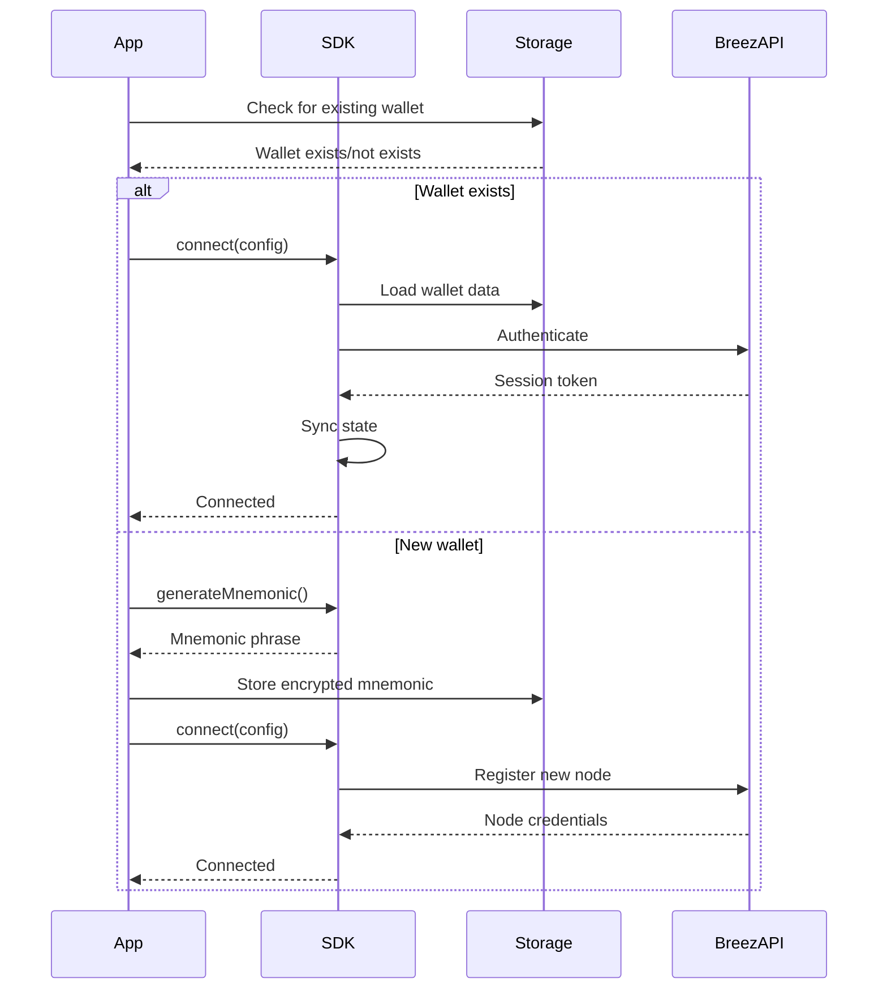

## Epic Reference
Part of Epic: **Breez SDK Integration for Expo App** (`epic:97fd7dcb-10ec-46a8-b681-b2805eb0eb56`)
SRS Spec: `spec:97fd7dcb-10ec-46a8-b681-b2805eb0eb56/a8f8bef7-d1c5-4113-a9ad-6092120bfe76`

## Overview
Initialize and configure the Breez SDK (Spark implementation) on wallet startup. Connect with API key, network (testnet/mainnet), and working directory. Register event listeners and handle connection state.

**Related SRS Requirements:** FR-SDK-001, FR-SDK-002, Section 7.3–7.5

## Tasks
- [ ] Load SDK config: apiKey, network (bitcoin/testnet), workingDir, optional inviteCode
- [ ] Implement initialization sequence: check existing wallet → connect(config) or generate mnemonic → connect
- [ ] Register event listeners: paymentReceived, paymentSent, paymentFailed, channelOpened, channelClosed, syncComplete, nodeStateChanged
- [ ] Ensure UI updates within 500ms of events; persist events for debugging
- [ ] Handle SDK init failures with retry (exponential backoff)
- [ ] Persist SDK state across app restarts
- [ ] Clean up listeners on SDK disconnect

## Acceptance Criteria
- [ ] AC-SDK-001-01: SDK initializes with valid API key
- [ ] AC-SDK-001-02: SDK connects to appropriate network (testnet/mainnet)
- [ ] AC-SDK-001-03: SDK initialization completes within 10 seconds
- [ ] AC-SDK-001-04: System handles SDK initialization failures gracefully
- [ ] AC-SDK-001-05: SDK state is persisted across app restarts
- [ ] AC-SDK-002-01 to 05: All SDK events registered; payment events update UI in 500ms; channel/sync/error events handled

## Diagram (SRS 7.3.2)

## Dependencies
- [ ] #1 Setup Expo Project with Breez SDK Integration
- [ ] #2 Implement Wallet Creation and Restoration

---
**Ticket ID:** `ticket:97fd7dcb-10ec-46a8-b681-b2805eb0eb56/60a202ea-26a2-4df7-91ae-4b37b9fc6f1d`
