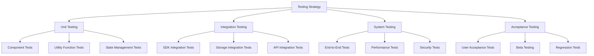

## Epic Reference
Part of Epic: **Breez SDK Integration for Expo App** (`epic:97fd7dcb-10ec-46a8-b681-b2805eb0eb56`)
SRS Spec: `spec:97fd7dcb-10ec-46a8-b681-b2805eb0eb56/a8f8bef7-d1c5-4113-a9ad-6092120bfe76`

## Overview
Implement testing suite and quality assurance: unit tests (Jest, React Native Testing Library), integration tests (SDK, storage, API), E2E and performance and security tests. Align with SRS Section 10. Set up CI (e.g. GitHub Actions) for automated test runs.

**Related SRS Requirements:** Section 10 (Testing Requirements)

## Tasks
- [ ] Configure Jest and React Native Testing Library; mocking for Breez SDK and native modules
- [ ] Unit tests: business logic (90%), utilities (95%), state (85%), API clients (80%), UI (70% target)
- [ ] Integration tests: SDK init, create invoice, pay invoice, channel open, events, errors; storage save/restore/migration; network offline/online
- [ ] E2E scenarios: onboarding, receive payment, send payment, withdrawal, wallet recovery
- [ ] Performance: app launch &lt;3s, invoice &lt;2s, payment &lt;10s, list 100 items &lt;1s, memory &lt;200MB
- [ ] Security: auth bypass, brute force, keychain/db encryption, network security, input validation
- [ ] GitHub Actions (or CI) workflow: run unit and integration tests on push/PR
- [ ] Test deliverables: test plan, test cases, coverage reports; defect tracking (e.g. GitHub Issues)

## Acceptance Criteria
- [ ] Unit test coverage meets SRS 10.2.1 targets for critical components
- [ ] Integration tests cover SDK, storage, and network scenarios from SRS 10.3
- [ ] E2E tests cover critical user flows from SRS 10.4.1
- [ ] CI runs tests automatically; results visible on PRs
- [ ] Beta testing plan (TestFlight / Internal Testing) and regression process defined

## Testing Strategy (SRS 10.1)

## Dependencies
- [ ] All feature issues #1–#9 (Testing validates implemented features)

---
**Ticket ID:** `ticket:97fd7dcb-10ec-46a8-b681-b2805eb0eb56/8aac7435-def5-4837-bc7f-b1094e676254`
